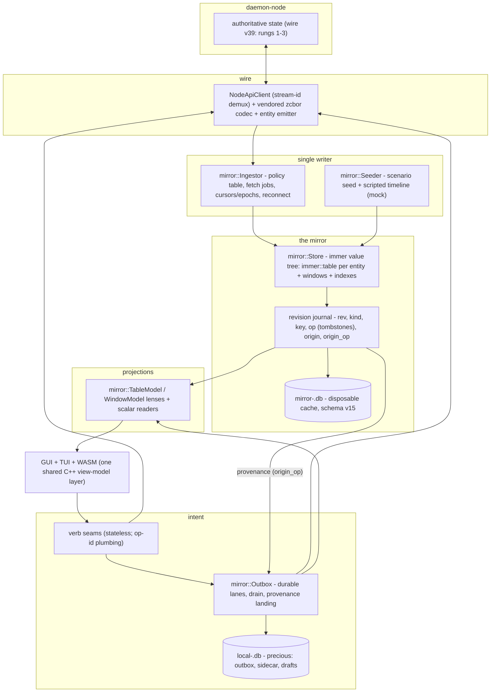

# daemon-app client data architecture — the mirror

Status: **shipped.** This is the architecture, not a proposal. The client's data layer is the
mirror: one typed value tree that mirrors the node's authoritative state, fed by a single writer,
observed through a revision journal, rendered by lenses, and mutated only through verb seams and a
durable outbox. Every read surface (sessions, fleet, routing pins, conversations, contacts,
persons, adapters, accounts, transcripts, chat, models, profiles, approvals) projects the mirror in
BOTH the daemon and mock feeders; no pre-mirror data path remains.

This document is the in-repo map of the implemented design. The normative contract lives in the
superproject architecture spec `docs/architecture/09-specification.md` (with `07-client-inventory.md`
as the pre-program baseline and the ADRs for the ratified decisions); the wire protocol is
normative in `daemon-node`'s sync-protocol spec. The per-package build history is recorded in
`src/core/mirror/LEDGER-*.md`, and the closing audit + known-debt register in `LEDGER-a9.md`. The
enforceable rules distilled for review are in the repo `AGENTS.md` ("Data layer — the mirror is the
only client model").

---

## 0. Conclusions up front

1. **There is one client model.** The `mirror::Store` holds an `immer` value tree — an
   `immer::table` per entity kind plus windows and relation indexes — and it is the single source
   every surface projects from. The pre-program fracture (a split-brain `IDaemonNet` graph *and*
   per-domain repositories with an arbitrary sqlite cache subset) is gone.
2. **One writer, one journal.** `mirror::Ingestor` (daemon) or `mirror::Seeder` (mock) is the only
   component that writes the store. Each commit stamps a revision journal; lenses consume ordered
   journal deltas (with tombstones), never re-derive order per consumer.
3. **Intent flows out through seams + the outbox; the loop closes through the node.** Verb seams
   are stateless. Offline-durable mutations go through durable `mirror::Outbox` lanes; a mutation's
   domain effect becomes visible only when the node's provenance-stamped delta lands in the store —
   never by locally mutating a mirrored row.
4. **Entities are generated.** One typed struct per entity, generated from `entity-map.toml` + the
   `daemon-node` CDDL contract, guarded by a drift gate. Role maps read the typed entity, so the
   5-way conversation / 6-way session / 4-way contact row forks the client used to carry collapse
   to one shape each.

---

## 1. Component map

Data flows one way: node → ingestor → store + journal → lenses → surfaces. Intent flows surfaces →
verb seams → (outbox lane or direct wire) → node, and the effect returns through the same
node→ingestor read path.

---

## 2. The store — one typed value tree

`mirror::Store` (`src/core/mirror/store.h`) owns a root `immer` value composed of an `immer::table`
per entity kind, plus windowed collections and relation indexes. Its only mutation surface is a
`Batch` obtained by the writer; the read surface is `mirror::Reader`, which has no write API by
construction (a `friend`/cast to reach one is the review reject enforced by AGENTS.md law 1).

- **Entity classes** (`M` mirrored+persisted, `W` windowed, `L` live-in-memory, `T` transient) are
  declared once in `entity-map.toml` and generated (§7). The census is complete against the v39
  read surface — including entities that previously had no client representation at all.
- **Commit discipline.** One commit per applied batch; the commit is the single observation point.
  A debug fingerprint records which component wrote (`Ingestor` xor `Seeder`) — a second writer
  asserts (§14.3).
- **Persistence — two databases.** `mirror-<id>.db` (schema **v15**) is a disposable, per-identity
  cache: a version mismatch drops and rebuilds it (it is never authoritative, so a torn write is
  recovered by re-fetching). `local-<id>.db` is precious: the outbox, the client-local sidecar, and
  drafts live there and survive cache nukes and app updates. Writes are batched write-behind
  (`immer::diff` over successive roots), not per-row.

---

## 3. The journal — active from wave 0

Every commit appends journal records `{rev, kind, key, op, origin, origin_op}` (op includes
tombstones for removes). The journal is the ordered delivery channel to lenses and the basis for:

- **Delta projection** (§5): lenses replay records above their watermark into exact row ops.
- **Provenance landing** (§6): a record carrying `origin_op == op_id` marks the originating outbox
  op landed/visible.
- **The parity assert** (debug/CI): journal-replay of a scope must equal the `immer::diff` of the
  two snapshots — the invariant that keeps the delta path honest (§4.4/§12).

---

## 4. The ingestor — the single wire writer

`mirror::Ingestor` (`src/core/mirror/ingestor.{h,cpp}`) absorbs what used to be a
`SubscriptionManager` plus a 19-call connect-ready refetch storm plus per-callsite refresh folklore:

- **Event→action policy table** (`policy_table.h`): one row per `NodeEvent` arm declaring the
  action (fetch / patch-in-place / nudge / mark-stale-scan), the fetch op, and the coalescing lane.
  The `switch` is exhaustive over the `NodeEvent` enum with no `default`, so a new wire arm that
  omits its row fails to compile.
- **Fetch jobs** (`fetch_job.h`, `fetch_scheduler.{h,cpp}`): the repositories' fetch cores are
  absorbed as declarative jobs the scheduler runs; the connect-ready storm becomes a staleness scan.
- **Cursors, epochs, reconnect** (`sync_state.{h,cpp}`): per-(session, epoch) applied-seq watermarks
  and the node-wide feed cursor persist across restarts; reconnect resumes from the cursor and
  re-baselines from the journal on an epoch increase / `head_seq < cursor` / `Reset`.
- **Both modes** (§5.6 of the spec): degraded `refetch_diff` against api/38 and full `wire_delta`
  (Bootstrap + `since_rev`) against api/39, switched per collection the first time api/39 is seen.
- **Diff-before-write** so a re-fetch that changes nothing produces no journal churn.
- **Staleness ownership**: `ensureFresh` is the ingestor's; lenses declare visibility only — a
  timer or refetch call in a lens is a defect (§5.8, AGENTS.md law 10).

---

## 5. Projections — lenses over the journal

Collection view-models subclass one generic adapter, `mirror::TableModel<Entity>`
(`table_model.h`): it consumes its kind/scope's journal deltas above a watermark and emits exact
`beginInsertRows`/`beginRemoveRows`/`dataChanged` through a maintained sort-key index (node-supplied
ordering only — presentation sort, never domain derivation). Tombstones arrive as ordered removes;
model resets are forbidden outside initial population (§8.1, AGENTS.md law 3). Windowed collections
use `WindowModel` (`window_model.h`). 64-bit stable ids back `QModelIndex::internalId` (fixing the
32-bit collision the old Sink-style hashing risked).

Each concrete VM contributes only its role map (`roleNames()` + a `data()` switch reading the typed
generated entity). This is where the 5-way/6-way/4-way row-shape forks died: the entity is the only
shape, and it cannot fork without failing the drift gate. Scalar/detail surfaces read through the
coarse observe seam (`observe.h`, `observe_coarse.*`; the lager-vs-coarse decision landed on coarse
per ADR-008). Projections are GUI-free C++; the TUI binds the same models through
`DisplayRoleAdapter`.

---

## 6. Intent — verb seams and the outbox

- **Verb seams** are small stateless QObjects: they read the store, have no store write API, and
  hold no domain state (§7, AGENTS.md law 5). Direct verbs in the rung-3 set mint an op-id per call
  and reuse it across retries.
- **The outbox** (`src/core/local/outbox.*`) is a durable state machine with per-lane ordering.
  The §6.4 census is fixed: `chat-send`, `conv-meta`, `roster-edit`, `session-meta`, `turn-prompt`.
  Enqueue commits to `local-<id>.db` before any send, so a queued mutation survives crash/restart.
- **Pending is not a row.** A pending mutation renders only through the outbox lens (pending strip /
  queue panel), never as a mirrored entity — the mirror never contains a row the node did not
  confirm (§14.7).
- **Confirmation is provenance-keyed, uniformly.** An ack (`Ok`) moves an op to `accepted`; a
  journal delta carrying `origin_op == op_id` moves it to `landed`. No verb defines its own matching
  and domain ids play no role (§6.6, §14.13). Auto-replay after reconnect is enabled per-connection
  only against api/39 (dedup + provenance shipped); against api/38 lanes hold for a manual "send"
  tap (§6.8).
- **Rejection UX** (§6.5): a node rejection pauses the lane; every rejected entry offers
  retry/edit/discard in both GUI and TUI, and the failure also surfaces on the initiating seam's
  typed signal. Never silent divergence.

---

## 7. Codegen — the entity emitter and the drift gate

`entity-map.toml` (human-owned) maps each entity's fields to the `daemon-node` CDDL wire shapes;
the entity emitter generates the typed structs, mappers, and reflection (`generated/`,
`entities_map.cpp`, `entity_reflect.h`). Rules:

- Never hand-edit generated regions or the vendored codec (`src/core/daemon/codec/{generated,
  vendor}`). Change `entity-map.toml` + the CDDL, then regenerate via the superproject
  `just update-codec`.
- The **drift gate** fails the build if the vendored/generated copies diverge from the pinned
  contract — this is what makes "a second client-side shape for a mirrored entity" a build failure
  rather than a review note (§3.6, §14.1).

---

## 8. Mock mode — same store, different feeder

Mock mode is the same store / journal / lenses fed by `mirror::Seeder` (`seeder.*`) instead of the
ingestor, so mock⇄daemon parity holds by construction (§9). A `mirror::Scenario` is a declarative
seed set + scripted timeline + `apiVersion` (38/39) + `VerbScript`; the mock host plays it on an
injectable clock and answers the outbox's `sendRequested` from the script (`ok`/`reject`/`timeout`/
`delay`), including the mandatory rejection fixture. `DAEMON_APP_MOCK_SCENARIO` selects `default |
api38 | empty`. There are no per-seam data mocks and no mock-only behavior below the verb boundary
(§14.5). See AGENTS.md "Mock mode" for the operational rules.

---

## 9. What this superseded

The pre-program client (baseline in `07-client-inventory.md`) carried two competing data
philosophies at once: a mock-first `IDaemonNet` "unified net model" that only ever half-landed on
the daemon side, and per-domain `I*Service` seams over wire repositories with a sqlite cache that
covered an arbitrary subset of domains. The consequences it documented — a split-brain seam, 5/6/4
divergent row layouts per entity, per-callsite refresh policy, a 19-call connect storm, mock/daemon
shape forks — are the exact defects the mirror removes. The migration deleted `IDaemonNet` +
`MockDaemonNet` + `DaemonDaemonNet` + the legacy sidebar path (M3), the `CachedSessionStore` /
`SessionRepository` session spine and the fleet/routing caches (M4/AD), the per-seam data mocks
(M5/AD), and the transcript dual-write (so the mirror sink is the single transcript writer). The
surviving repositories are wire fetch/verb feeders for the ingestor and the direct verb seams — not
read models. The full deleted-vs-survivor census with reproducible counts is in
`src/core/mirror/LEDGER-a9.md` (the F6 audit).
