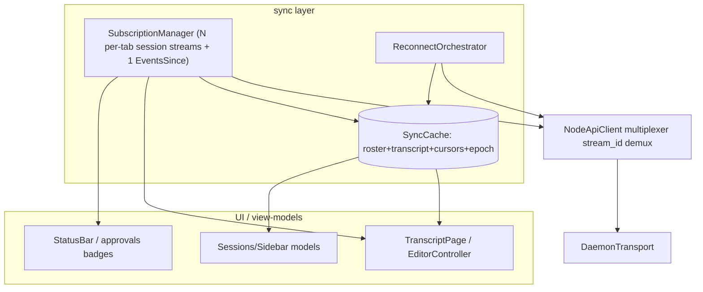

# daemon-app client sync architecture — target design

Status: research / design proposal (no code yet).

Companion to the authoritative wire spec `daemon-node/docs/specs/daemon-sync-protocol-spec.md` (the
multiplexed/streaming transport, epoch-safe resync, `EventsSince` feed, and delta lists) and to
[`multi-protocol-client-surface.md`](multi-protocol-client-surface.md). New daemon-backed seams should
also follow the [adapter recipe](../src/core/daemon/README.md).

This document specifies the **client half**: how `daemon-app` consumes the target sync protocol so it
stays in sync across disconnects/restarts/focus changes at minimal bandwidth. It maps the wire layers
(L0–L4) onto concrete Qt components and states exactly which current behaviors each supersedes. The
wire shapes themselves are normative in the daemon-node spec; this doc does not redefine them.

---

## 0. Conclusions up front

1. **`NodeApiClient` becomes a multiplexer, not a single-in-flight queue.** Today it serializes every
   consumer behind one in-flight request ([`node_api_client.h`](../src/core/daemon/node_api_client.h)).
   The target client tags each exchange with the wire `stream id`, demultiplexes `Reply`/`Item`/
   `End`/`Reset` frames to the owning consumer, and supports long-lived push subscriptions alongside
   one-shot commands.
2. **A `SubscriptionManager` owns focus, which is a *set* of sessions, not one.** The GUI/TUI can
   have several session tabs open at once (plus settings/other tabs), so several detailed
   subscriptions are live concurrently - one per open session tab (and a fleet/rooms multi-pane can
   add more). The manager keeps a `session id -> subscription` map (each its own `stream_id`,
   `(epoch, cursor)` watermark, and cache slice); one `EventsSince` feed covers every session **not**
   currently subscribed; nothing polls unfocused sessions. The L0 multiplexer makes N concurrent
   streams cheap (one connection, no head-of-line blocking), and the daemon holds no cross-session
   client state, so this is purely a client-side bookkeeping concern.
3. **A durable `SyncCache` is wired up and *read*.** The dormant `daemon_sync_cursors` table and a new
   durable transcript cache become the resume substrate; reconnect/refocus replays from cache + a
   short journal delta, not a full re-stream.
4. **A `ReconnectOrchestrator` replaces the full-refetch-on-ready.** On reconnect it resumes the
   events feed from its cursor, re-baselines the focused session via the `(epoch, seq)` check, and
   delta-syncs lists — instead of re-pulling everything.

---

## 1. Component map (target)

---

## 2. L0 client — `NodeApiClient` as a multiplexer

- **Stream-id table.** Replace the single `m_inFlight`/`m_currentCorrelation` with a map
  `stream id → handler`. `Call` is sent with a fresh monotonic id; `Reply` resolves and frees a
  one-shot id; `Item` dispatches a stream chunk to the owning handler; `End` closes the stream
  (clean or with an error); `Cancel` is sent on teardown. The existing `correlationId` API can be
  preserved as a thin wrapper over one-shot `Call`s during migration.
- **No more head-of-line blocking.** Health, commands, and subscriptions are independent streams;
  the 30 s per-request timeout (kept from Phase 1) applies per one-shot exchange, while streams use
  the keepalive/`End` liveness from the wire spec §3.3.
- **`Reset` handling.** A `Reset{epoch, head_seq}` frame is routed to the stream's handler and
  triggers re-baseline (§4) — the client never silently skips lost frames.
- **Interim (pre-envelope).** Per the wire spec §2.6, the client may first open a **dedicated
  `DaemonTransport` connection** for each long-poll subscription while commands stay on the shared
  client. This is the migration bridge; the multiplexer is the destination.

Supersedes: the single-in-flight FIFO model in
[`node_api_client.cpp`](../src/core/daemon/node_api_client.cpp).

---

## 3. L1 client — push/long-poll subscription, no busy-poll

- **`DaemonTurnEngine` stops busy-polling.** The 120 ms `m_pollTimer`
  ([`daemon_turn_engine.cpp`](../src/DaemonApp/Turn/daemon_turn_engine.cpp)) is removed. Under L0 the
  engine opens a push `Subscribe` stream and renders `Item` batches as they arrive; on the interim
  connection it issues `Subscribe{wait_ms}` and re-issues on each return. Idle-but-active turns cost
  no traffic.
- **State mapping is unchanged.** `thinking`/`streaming`/`stalled` and the HITL park/`awaitingInput`
  flow stay as-is; only the *delivery* of `LogPage`s changes. The decode path
  (`decodeLogPageEntries`) is shared between push and long-poll.
- **Phase 1 resume folds into reset detection (§4):** the "stalled → retry from `m_cursor`" backoff
  remains for a pure transport blip, but a blip that coincides with an epoch change becomes a
  re-baseline instead of a same-cursor retry.

Supersedes: `kPollIntervalMs` busy-poll; the dead `SessionRepository::subscribe()` is replaced by the
`SubscriptionManager` path.

---

## 4. L2 client — epoch tracking, reset detection, journal re-baseline

- **Track `(epoch, cursor)` per session**, not just `seq`. On each page/`Item`, apply the wire spec
  §4.3 decision: continue, or re-baseline on `epoch` increase / `head_seq < cursor` / `Reset`.
- **Re-baseline from the journal.** On reset, the client calls `SessionHistory{after_cursor}` from the
  persisted journal cursor, honors `sealed_after` (truncate the rendered transcript to the seal
  boundary — the existing rewind boundary), applies the journal delta de-duplicated by `(epoch, seq)`,
  then resumes the live subscription at the new epoch. This closes the daemon-restart desync that
  Phase 1 supervision can trigger.
- **HITL safety across reconnect.** A re-baseline must re-surface an unanswered parked `Request`
  (durable as a `transcript-block-request`) so an approval prompt is not lost; the engine re-enters
  `awaitingInput` for it.

Supersedes: the absence of any `head_seq`/epoch check in the turn engine; the unused durable journal.

---

## 5. The applied-seq watermark — the one rule that makes streaming safe

This is the client invariant the wire spec §4.8 depends on, called out separately because it is the
single most load-bearing piece of client state.

- The transcript ingest (`EditorController`/`TranscriptIngest`) keeps a per-`(session, epoch)`
  **applied-seq watermark `W`** and **applies an entry iff `seq > W`** (then advances `W`).
- This is mandatory because `TextDelta`s are *additive*: replaying one doubles text, so dedup is by
  `seq`, never by content or block identity. The watermark makes every other mechanism (overlap
  between journal backfill and live backlog, idempotent reconnect retry, push/long-poll equivalence)
  correct by construction.
- `W` is persisted in `SyncCache` (§7) so a cold start resumes without re-applying cached entries.

---

## 6. Lazy focus — the client snapshot↔stream handoff

When the user focuses a session that the `EventsSince` feed says is actively streaming, the
`SubscriptionManager` runs the wire spec §4.8 handoff. Order is everything:

1. **Subscribe first.** Open the live `Subscribe{session, after_seq = W}` (push, or long-poll on the
   interim) **before** fetching history, so tokens generated during the load are already captured in
   the live stream's backlog (the server attaches backlog+live atomically). Mark the session
   `loading`.
2. **Backfill behind it.** If the cache lacks history below the live log's retained low-water mark,
   fetch `SessionHistory{after_cursor}` up to its head `seq = B` and render coalesced blocks; apply
   live entries with `seq > B`.
3. **Apply by `(epoch, seq)`**, dropping `seq <= W` (§5), asserting contiguity. A gap not explained by
   an in-progress backfill ⇒ re-`Subscribe{after_seq = W}`.
4. **Flip to `streaming` at a definite point:** when applied `seq >= head_seq` reported by the first
   page. Before that the UI shows a catching-up affordance, not a half-rendered guess.
5. **Edges:** an `epoch` increase or a `Reset` mid-load routes to the §4 re-baseline (from the journal)
   rather than continuing; a transport drop resumes idempotently from `W`.

Each open session tab runs this handoff independently, keyed by its session id and `stream_id`, so
several can be `loading`/`streaming` at once with no shared state between them (the per-`(session,
epoch)` watermark §5 is a map). Closing a tab `cancelStream`s just that subscription; the session
then falls back to the `EventsSince` feed (§8). A session opened in two tabs shares one subscription
(ref-counted) rather than opening two streams for the same log.

Supersedes: today's turn-only, single-session, cursor-from-0 model — focusing a non-active or
mid-stream session (let alone several at once) has no defined load path in the current client.

---

## 7. Durable `SyncCache` — wire up the dormant cache

[`client_cache_schema.h`](../src/core/daemon/client_cache_schema.h) defines `daemon_sessions`,
`daemon_transcript_blocks`, `daemon_sync_cursors`, `daemon_fs_entries`, and others. As of L3/L4 + Phase 4
the live tables are wired: the **transcript is cached** as coalesced `daemon_transcript_blocks` and
[`CachedSessionStore::content()`](../src/core/daemon/cached_session_store.cpp) renders from it; the
roster (`daemon_sessions`), the resync cursors (`roster-rev`, `events-since`, per-session
`watermark`/`epoch`), and the fs tree (`daemon_fs_entries`, via `DaemonFsService`) are all live. The
legacy `daemon_session_log` + `SessionRepository::subscribe()` live-log pull path is dead (the turn
engine streams via the mux `Open` + the transcript cache) and is slated for removal. Target:

- **Persist per session:** the live `(epoch, seq)` watermark `W` and the durable `journal cursor` of
  the last block rendered, plus the rendered transcript blocks keyed by journal cursor.
- **Read on startup/refocus/reconnect:** load the cached transcript, then fetch only the journal delta
  past the stored cursor — cold start and refocus avoid a full re-stream.
- **Roster delta + prune:** store the roster `rev`; on reconnect query `SessionsQuery{since_rev}` and
  apply `removed` (today removed sessions are never purged from
  [`cached_session_store.cpp`](../src/core/daemon/cached_session_store.cpp)).

Supersedes: write-only `daemon_sync_cursors`; stale-forever cached roster; no transcript cache.

---

## 8. L3 client — the `EventsSince` consumer

- **One feed, focus-driven detail.** The `SubscriptionManager` keeps a single `EventsSince` stream
  alongside its set of per-tab session subscriptions, and routes notifications: a `SessionAdvanced`
  for a session that **is** subscribed (any open tab) nudges that session's own detail subscription;
  for an unsubscribed one it just marks the roster row / badge; `RosterChanged`/`SessionMetaChanged`
  mark roster rows stale (refetch lazily / on view); `ApprovalPending` updates the approvals badge;
  `DownloadProgress` updates the Models hub without the 600 ms `ModelDownloads` poll; `ResyncNeeded`
  triggers a baseline refetch of the named scope.
- **No speculative fan-out.** The client opens a detailed `Subscribe` only for sessions an open tab
  is actually showing (possibly several); it never subscribes to a session no tab shows just to keep
  a badge fresh — that is what the single feed is for. Detail is loaded per tab, on focus, via §6.

Supersedes: full-refetch-on-ready as the only awareness mechanism; the `ModelDownloads` 600 ms poll
(becomes event-driven); roster staleness between reconnects.

---

## 9. L4 client — `ReconnectOrchestrator`

Replaces the edge-triggered full refresh in
[`app_service_graph.cpp`](../src/core/daemon/app_service_graph.cpp). On a transition into `ready`:

1. Resume the `EventsSince` feed from the persisted feed cursor (or full-baseline if absent /
   `ResyncNeeded`).
2. Re-baseline **every open-tab** session via the `(epoch, seq)` check (§4/§6) — one re-baseline per
   live subscription, concurrently; leave unsubscribed sessions to the feed.
3. Delta-sync the roster via `SessionsQuery{since_rev}` and prune `removed`; refetch other small lists
   (profiles/credentials/models) full for now, event-gated later (wire spec §6.2).

The "refresh fires only on transition into ready" guard from Phase 1 stays; the *content* of that
refresh changes from full-everything to feed-resume + focused re-baseline + roster delta.

Supersedes: the unconditional full `SessionsQuery`+profiles+credentials+models+approvals refetch on
every reconnect.

---

## 10. Migration order (mirrors the wire spec §8)

1. **L2 + L1 long-poll on a dedicated connection** — wire up cursors/epoch + journal re-baseline + the
   applied-seq watermark (§5), move the turn off the 120 ms poll. No multiplexer yet. Fixes
   correctness + the worst bandwidth.
2. **L0 multiplexer + push** — convert `NodeApiClient` to stream-id demux; fold the interim
   connections into one.
3. **L3 `EventsSince` consumer + `SubscriptionManager` (incl. the §6 lazy-focus handoff)** —
   out-of-focus awareness; retire the `ModelDownloads` poll.
4. **L4 `ReconnectOrchestrator` + roster delta** — delta reconnect + pruning.

### 10.1 Test alignment

Extend `daemon-app` unit coverage (e.g. a `tst_sync_resync` analogous to `tst_connection_resilience`)
for: epoch-increase → journal re-baseline; `head_seq < cursor` → re-baseline; `Reset` → re-baseline;
applied-seq watermark drops `seq <= W` (no doubled deltas); lazy focus of a mid-stream session loses
no tokens and reaches `head_seq` (§6); **two concurrent session subscriptions stay independent** (a
`Reset`/epoch bump on one does not disturb the other's watermark/cache); parked `Request` survives a
reconnect; multiplexer demux of interleaved `Reply`/`Item`. The end-to-end kill+restart-mid-turn and "idle turn produces no busy-poll"
assertions live in `system-tests` per the wire spec §7.4.