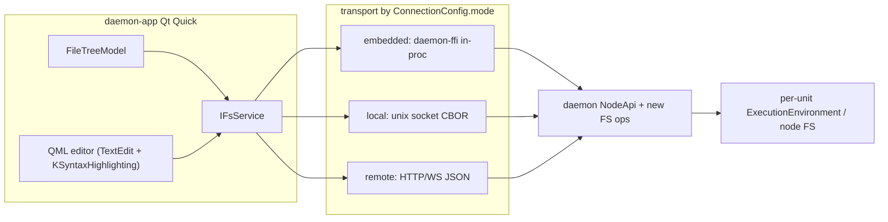

# File browser / workspace design spec

Status: Phase 1-2 implemented in `daemon-app` against a local-disk development
service; daemon FS adapter pending. This document remains the design reference
for aligning the file/workspace browser and file/text editor with the daemon
backend's architecture and the app's QML-first, mobile-capable shell.

## Scope and non-goals

In scope:

- A **daemon-served** file/workspace browser (the GUI never reads the local disk for
  workspace content).
- A **QML-native** file/text editor (code + markdown), syntax-highlighted, that lives in the
  existing VS Code-style tab strip.
- The GUI seam (`IFsService`), the proposed backend surface (`daemon-api` FS ops), and the
  editor's Document/View model (clean-room port from KTextEditor + Lite XL).

Out of scope (deferred, called out where relevant):

- Language servers / IDE-grade autocompletion, multi-machine file federation, collaborative
  (OT/CRDT) editing, embedded terminal/PTY. These are noted as future layers, not built here.

## Reference material

Cloned under `daemon-app/references/` (study/port references, not dependencies):

- `references/lite-xl` - Lite XL editor, **MIT**. Algorithms freely borrowable.
- `references/CodeEditor` - Qt CodeEditor (Andy Nichols), **GPL-3.0-only OR Qt-Commercial**.
  It embeds the whole Lite XL Lua editor in a `QThread` painting via Qt Quick Scene Graph.
- `references/ktexteditor` - KDE Frameworks KTextEditor, **LGPL-2.0-or-later**. Study and
  clean-room reimplement patterns; do not copy substantial code.

The companion backend surface is sketched in
`../daemon/docs/specs/daemon-fs-surface-spec.md`.

## 1. Findings

### 1.1 daemon-app today (Qt 6.11 QML/C++)

- QML-first shell: `QQuickWindow` + `Main.qml`; Qt Widgets are used only for the system tray.
  This is a hard constraint - the app targets mobile with hardware rendering, so the editor
  must be a `QQuickItem`/QML component, not a `QWidget`.
- VS Code-style tabs are driven by `TabModel` (`src/DaemonApp/Tabs/tab_model.h`), a shared
  `QAbstractListModel` (GUI + TUI). Tab `Kind` is currently `Transcript` plus singleton
  manager pages (Settings, Models, Fleet, ...). `Conversation.qml` renders each tab via a
  `Loader` switched on `kind`.
- A ported **BlockEditor** (`src/DaemonApp/BlockEditor/`) renders/edits markdown (md4qt AST
  + KSyntaxHighlighting for fenced code + MicroTeX for math). It is markdown-first and is
  used for transcripts today via `EditorController`
  (`src/DaemonApp/BlockEditor/app/editor_controller.h`), which exposes a file-ish
  persistence API: `openPersistence(path)` / `flushChangedBlocks()`.
- **KSyntaxHighlighting** is already vendored and exposed to QML as
  `org.kde.syntaxhighlighting` (used by `CodeBlock.qml` for fenced-code rendering). Note: that
  is markdown-fence rendering inside transcripts, not a text editor.
- Backend is **not** wired. `Application` constructs mocks (`MockConnectionService`,
  `MockDaemonConfig`, ...). The transport seam is `IConnectionService`
  (`src/core/connection/iconnection_service.h`) with `ConnectionConfig.mode` =
  `embedded | local | remote` (`src/core/connection/connection_dtos.h`). "UI never sees the
  codec."
- **No file browser, no workspace tree, no generic text-file tabs.** "Workspace" today is two
  config fields (`WorkspaceSection.qml` -> `DaemonConfig` keys `workspace/root`,
  `workspace/followGitignore`). The feature audit (`docs/feature-coverage-audit.md` C)
  explicitly defers "file-preview rail + workspace/git tree" until `../daemon`.

### 1.2 daemon backend (`../daemon`, Rust)

- The canonical external surface is **`daemon-api`** (`crates/contracts/daemon-api`): one
  interface (`SessionApi` + `ControlApi`, composed as `NodeApi`), with a serializable mirror
  (`ApiRequest`/`ApiResponse`, CBOR, `API_WIRE_VERSION`) and a shared `dispatch`. In-process
  calls hit the trait directly; the Unix socket and FFI run the same `dispatch`. The GUI's
  three `ConnectionConfig.mode`s map onto this exactly:
  - `embedded` -> C ABI (`daemon-ffi`, currently a stub), in-process, same machine;
  - `local` -> Unix-socket CBOR to a sibling daemon process;
  - `remote` -> HTTP/WS JSON (`daemon-http`) to a daemon on another machine.
- **There is no GUI-facing filesystem API today.** Files live in a per-session
  `ExecutionEnvironment` sandbox (`crates/engine/daemon-core/src/exec/`); agents touch them
  only via the `fs`/`shell` tools (`tools/daemon-tool-fs`). The host spec (`daemon-host-spec.md`
  7) defines a per-session **workspace** as a "tool-owned external resource, not part of the
  snapshot," provisioned by `daemon-provision`.
- **Filesystem is locality-bound.** A unit's workspace lives on whichever node/process runs
  that engine. A *placed* child (placement cut) or a *remote* node hosts its own files; the
  GUI's machine is irrelevant. `ControlApi::tree()` projects the unit tree by `UnitId`, but
  `(UnitId -> placement host)` is not exposed on the wire.
- Backend gaps relevant here: `EngineProfile::with_exec` (root engines in a provisioned
  workspace) exists but is **never called**; multi-node clustering is deferred.

### 1.3 Hermes Desktop (reference product)

- Read-only `react-arborist` tree + `react-shiki` read-only preview; **editing is delegated
  to the agent's tools**, not done in-app.
- **Dual transport**: WebSocket JSON-RPC for chat; Electron IPC / REST `/api/fs/*` for files.
  In remote mode the tree reads `/api/fs/list` on the remote host - i.e. files are
  backend-served, confirming the locality argument above.
- "Workspace" == current working directory (`cwd`), persisted in localStorage; no multi-root
  `.code-workspace` concept.

### 1.4 Reference audits (editor + tree)

- **Qt CodeEditor == Lite XL in Qt**: a `QQuickItem` painting a background-thread Lite XL via
  Scene Graph nodes. QML-compatible, but GPL/Qt-Commercial, touch disabled
  (`setAcceptTouchEvents(false)`), IME stubbed, LSP via subprocess, and a near-zero composable
  API (`projectFolder`, `currentFile` only) while shipping its own IDE chrome.
- **Lite XL file tree** (`treeview.lua`) renders via a custom SDL software renderer (not
  portable), but its algorithms are: lazy expand + per-dir cache invalidation on watch,
  end-anchored `fuzzy_match`, natural `path_compare`, capped incremental find-file, static
  ignore patterns (not `.gitignore`), multi-root projects. MIT - borrowable.
- **KTextEditor and Lite XL converge** on the same editor architecture (Document/View split,
  per-line buffer, position sanitize on edit, inverse-op grouped undo, incremental per-line
  highlighting with an invalidation watermark). They differ in scalability (Kate 64-line
  `TextBlock`s vs Lite XL whole-file array), anchor strategy (Kate stateful `MovingCursor`/
  `MovingRange` registry vs Lite XL stateless recompute), and completeness (Kate has folding,
  marks, completion model; Lite XL core has none).

## 2. Settled decisions

1. **Files are daemon-served, never GUI-local.** All workspace content is reached through the
   daemon surface in every mode (including `embedded`, where the call is in-process). A
   `QFileSystemModel`/`QDir` over the GUI host disk is correct only by accident and is
   rejected as the source of truth.
2. **Scope = a node filesystem surface** (plus optional unit-scoped roots). "Workspace" is
   reframed: not a VS Code multi-root file, but *an opened root on the connected node*. The
   default root is the node's configured `workspace/root`; a conversation/unit's
   `ExecutionEnvironment` sandbox is a scoped root the user can open.
3. **Editor = QML-native** (`TextEdit`/`TextArea` + KSyntaxHighlighting), honoring the
   QML-first/mobile constraint. KTextEditor and embedding Lite XL/Qt CodeEditor are rejected
   as dependencies (section 5).
4. **File tree = QML-native** `QAbstractItemModel` backed by the FS seam, porting Lite XL's
   MIT algorithms (not its code).

## 3. Filesystem architecture

### 3.1 The GUI seam: `IFsService`

A transport-agnostic filesystem seam, a sibling of `IConnectionService` /
`IConversationStore` / `IPlatformServices`, living in `src/core/fs/`. The mock implementation
backs the UI now; a daemon adapter replaces it later by decoding the wire once. The UI never
sees the codec.

```cpp
// src/core/fs/ifs_service.h  (proposed)
namespace fs {

struct FsEntry {            // one directory child
    QString name;
    QString path;           // root-relative path, POSIX separators
    bool isDir = false;
    qint64 size = 0;
    qint64 mtimeMs = 0;
    bool ignored = false;   // matched the node's ignore rules (gitignore + artifacts)
    bool symlink = false;
};

struct FsRoot {             // an "opened root" on the connected node
    QString id;             // opaque handle from the node (e.g. "node:workspace", "unit:<UnitId>")
    QString label;          // display name (basename or unit title)
    QString unitId;         // non-empty when this root is a unit's ExecutionEnvironment
};

class IFsService : public QObject {
    Q_OBJECT
public:
    // Roots the connected node exposes (default workspace root + any opened unit sandboxes).
    Q_INVOKABLE virtual void listRoots() = 0;                                   // -> rootsChanged
    Q_INVOKABLE virtual void open(const QString& rootId, const QString& dir) = 0; // -> listed
    Q_INVOKABLE virtual void stat(const QString& rootId, const QString& path) = 0;
    Q_INVOKABLE virtual void read(const QString& rootId, const QString& path) = 0; // -> fileRead
    Q_INVOKABLE virtual void write(const QString& rootId, const QString& path,
                                   const QByteArray& bytes, const QString& baseRevision) = 0;
    Q_INVOKABLE virtual void search(const QString& rootId, const QString& query,
                                    const QVariantMap& opts) = 0;               // server-side
    // Subscribe to change events for an opened directory (analogous to SessionApi::subscribe).
    Q_INVOKABLE virtual void watch(const QString& rootId, const QString& dir) = 0;
    Q_INVOKABLE virtual void unwatch(const QString& rootId, const QString& dir) = 0;

signals:
    void rootsChanged(const QList<fs::FsRoot>& roots);
    void listed(const QString& rootId, const QString& dir, const QList<fs::FsEntry>& entries);
    void fileRead(const QString& rootId, const QString& path,
                  const QByteArray& bytes, const QString& revision, bool truncated);
    void writeResult(const QString& rootId, const QString& path,
                     bool ok, const QString& revision, const QString& error);
    void changed(const QString& rootId, const QString& dir);  // invalidate subtree cache
    void error(const QString& rootId, const QString& path, const QString& message);
};

} // namespace fs
```

Design notes:

- **Async, signal-based** to mirror `IConnectionService` and to suit a latency-bound remote
  transport: no blocking calls; the tree model fetches lazily and fills in on `listed`.
- **Root-scoped paths**: every op takes a `rootId` + a root-relative path. This keeps the GUI
  ignorant of absolute host paths and lets a root resolve to either the node workspace or a
  specific unit's sandbox (and, in future, a placed/remote host's filesystem).
- **Revisions**: `read` returns a `revision`; `write` carries `baseRevision` so the node can
  reject a stale write (lost-update guard). This is the hook the editor's remote-projection
  layer (section 6) builds on.
- **Watch is a subscription**, not polling, mirroring the streaming shape of
  `SessionApi::subscribe`; the mock can synthesize `changed` from its own writes.

### 3.2 Transport by `ConnectionConfig.mode`

The seam binds to the same surface in all three modes; only the bytes' path differs.



### 3.3 Why "workspace" is the wrong primitive, and what replaces it

The daemon has no global workspace; its real primitive is the per-session
`ExecutionEnvironment` sandbox. So the GUI models:

- **Node FS root(s)**: the connected node exposes at least one browsable root (default =
  configured `workspace/root`). This is the "open folder" experience, but the folder lives on
  the node.
- **Unit-scoped roots**: from a conversation/unit, the user can open that unit's sandbox as a
  root (`FsRoot.unitId` set). This is faithful to the daemon model and ties files to the agent
  that produced them.

A "workspace" in the UI is therefore just the set of opened roots for the active connection -
a view/bookmark concept, persisted client-side (`QtSettingsStore`), not an ownership concept.

### 3.4 Remote / placement locality

`ControlApi::tree()` already projects every `UnitId` at any depth, but a unit's files live on
the host that runs it. Two consequences for the FS surface:

- The node serving `IFsService` must resolve a `unit:<UnitId>` root to the correct
  `ExecutionEnvironment`, proxying to a placed/remote child when needed. Today
  `(UnitId -> placement host)` is not on the wire (section 4.3), so v1 targets the **local
  node's** workspace + locally-hosted unit sandboxes; placed/remote unit browsing is a later
  layer.
- The GUI must never assume a single local path; all paths are `(rootId, root-relative)`.

## 4. Proposed backend surface (`daemon-api` FS ops)

This is cross-repo work in `../daemon`; the GUI seam is designed so the UI lands first behind
a mock and the backend follows. A short companion stub lives at
`../daemon/docs/specs/daemon-fs-surface-spec.md`.

### 4.1 Where it goes

The FS ops join the existing one-surface model in `crates/contracts/daemon-api`:

- Add a `WorkspaceApi` (a.k.a. `FsApi`) trait alongside `ControlApi`, composed into `NodeApi`
  (so a node implements it once, every transport binds to it). Each method gets `#[async_trait]`
  and a default that returns "unsupported" so transports/nodes without FS support degrade
  gracefully (the pattern `ControlApi` already uses for `tree()`/`sessions_query()`).
- Add the serializable mirror variants to `ApiRequest`/`ApiResponse` (CBOR, governed by
  `API_WIRE_VERSION`; update `daemon-api.cddl`). The Unix socket and FFI reuse the shared
  `dispatch`; the HTTP/WS adapter (`daemon-http`) gets the JSON form and a streaming channel
  for watch (it already does this for `subscribe`/`tree/subscribe`).

### 4.2 Sketch

```rust
// crates/contracts/daemon-api  (proposed)
#[async_trait]
pub trait WorkspaceApi: Send + Sync {
    /// The browsable roots this node exposes: the configured workspace root, plus any
    /// unit sandboxes the caller has opened (FsRootId carries an optional UnitId).
    async fn fs_roots(&self) -> Vec<FsRoot> { Vec::new() }

    /// One directory's children (root-relative dir, "" = root). Server applies ignore
    /// rules (gitignore + artifacts) and marks `ignored` rather than hiding, so the GUI
    /// toggles visibility client-side.
    async fn fs_list(&self, root: FsRootId, dir: String) -> Result<Vec<FsEntry>, ApiError>;

    async fn fs_stat(&self, root: FsRootId, path: String) -> Result<FsEntry, ApiError>;

    /// Read bytes + an opaque content revision (used as write base / staleness guard).
    async fn fs_read(&self, root: FsRootId, path: String, max_bytes: u64)
        -> Result<FsContent, ApiError>;

    /// Write with optimistic concurrency: reject if `base_revision` is stale.
    async fn fs_write(&self, root: FsRootId, path: String, bytes: Vec<u8>,
                      base_revision: Revision) -> Result<Revision, ApiError>;

    /// Server-side project search (content/regex/glob); latency makes client-side walking
    /// wrong. Paginated like SearchPage.
    async fn fs_search(&self, root: FsRootId, query: FsSearchQuery)
        -> Result<FsSearchPage, ApiError>;

    /// Change subscription for an opened dir; streaming transport capability (like
    /// SessionApi::subscribe), one-shot poll form mirrored on the wire.
    async fn fs_watch(&self, root: FsRootId, dir: String) -> Result<FsWatchStream, ApiError>;
}
```

- `FsRootId` is an enum on the wire: `Workspace` (the configured root) or `Unit(UnitId)` (a
  session's `ExecutionEnvironment`). This is the single place locality is resolved.
- Reuse existing conventions: `ApiError`, `Revision` (already re-exported by `daemon-api`),
  `SearchPage`-style pagination.

### 4.3 Backend prerequisites and gaps (flagged, not solved here)

- **`EngineProfile::with_exec` is unwired**: engines default to a temp sandbox; the host
  doesn't yet root them at a provisioned workspace. `fs_roots`/`Unit(_)` resolution needs the
  provisioner -> engine wiring to land.
- **`(UnitId -> placement host)` is not on the wire**: browsing a *placed* or *remote* unit's
  files requires the owning node to proxy `WorkspaceApi` to that child. v1 scopes to the local
  node; this is the federation layer.
- **Ignore + search are server-side**: the node owns `.gitignore` evaluation and project
  search (it has the files and avoids round-trips). The GUI only renders results.
- **Sensitive-path policy**: `fs_write` to sensitive paths should respect the same gating as
  agent edits (`ApprovalMode`), so operator edits and agent edits share one policy.

## 5. The editor: QML-native (decision A)

### 5.1 Why not the candidates

- **KTextEditor (KF6)** is QWidget-based. Qt Quick's scene graph cannot host a `QWidget`
  inline; every workaround (QWidget-host shell + `QQuickWidget`, native overlay over a QML
  placeholder, detached editor windows) breaks the QML-first/mobile-hardware-rendering
  constraint. Rejected as a dependency; **kept as the primary porting reference** (section 6).
- **Qt CodeEditor / embedding Lite XL** is QML-compatible (Scene Graph), but: GPL-3.0/
  Qt-Commercial licensing; `setAcceptTouchEvents(false)` ("touch logic is not correct"); IME
  stubbed; completion/LSP via spawned subprocess (impractical on mobile); and a non-composable
  API (`projectFolder`/`currentFile` only) that ships its own tree/tabs/status chrome which
  would fight `TabModel`. Adopting it means forking both the C++ bridge and the Lua UI.
  Rejected as a dependency; **kept as an algorithm reference** (it *is* Lite XL).

### 5.2 What we build

A composable QML editor component (`src/DaemonApp/Editor/`), mobile-clean, theme-matched, no
new dependency:

- **Surface**: Qt Quick `TextArea`/`TextEdit` inside a `Flickable`, or a custom
  `QQuickItem` for large files (section 6.4). Text input, IME, and touch come from Qt Quick
  for free - the gap the Qt CodeEditor never closed.
- **Highlighting**: the already-vendored KSyntaxHighlighting QML `SyntaxHighlighter`
  (`org.kde.syntaxhighlighting`, the same plugin `CodeBlock.qml` uses), driven by definition +
  theme from the shared `Repository`, kept in sync with `Theme.isDarkMode`.
- **Gutter**: a custom line-number column (a sibling QML item bound to the model's line count
  and scroll offset), plus current-line highlight and fold chevrons.
- **Find/replace**: an inline find bar (the Transcript find bar is precedent) over the
  document's `Range`+options search (section 6).
- **Folding**: fold regions from KSyntaxHighlighting **folding-range info** (the one folding
  concern its README keeps in scope), rendered as gutter chevrons; a per-view fold map hides
  ranges (section 6).
- **Bracket matching**: a lightweight pass on the active line + match scan.
- **Deferred**: autocompletion / LSP. The model leaves a completion seam (section 6.7); a
  provider can later be the daemon or a language server. Not built in v1.

### 5.3 Markdown routes to the existing BlockEditor

Opening a `.md`/`.markdown` file does **not** use the code editor: it loads into the existing
`BlockEditor` via `EditorController::openPersistence(path)` /
`flushChangedBlocks()`, which already does markdown-first WYSIWYG with code/math/diagram
blocks. The `FilePage` (section 7) picks the editor by file type:

- markdown -> `BlockEditor` (reuse `EditorController`);
- everything else text -> the QML-native code editor;
- binary/image -> a read-only preview (image via the existing image cache; binary -> a "binary
  file" placeholder).

## 6. Editor Document/View model (clean-room port: KTextEditor LGPL + Lite XL MIT)

KTextEditor and Lite XL converge on the same canonical model; we clean-room reimplement the
convergent shape in C++/QML (`src/DaemonApp/Editor/` engine + QML). Study KTextEditor's
patterns (LGPL - no substantial copying); Lite XL's algorithms are MIT and may be ported
directly. The engine is plain C++ (a `da_editor` static lib, mirroring `be_core`) exposing
controllers to QML.

### 6.1 Layered model

- **Document (shared)**: a **block-based line buffer** - KTextEditor's `TextBlock` (~64-line
  chunks with split/merge on edit) chosen over Lite XL's whole-file array for O(1) line access,
  localized updates, and lazy/remote loading. Each line carries
  `{ text, hlState, attrs[], foldFlags }`. A monotonic `revision` plus a `TextHistory`-style
  transform supports remote sync (section 6.6). Columns are UTF-16 (QString-native), unifying
  Lite XL's byte columns and Kate's Unicode handling.
- **Anchors**: a **hybrid**. Carets/selections use Lite XL's stateless bottom-up recompute on
  each edit (cheap, ideal for multi-cursor). Long-lived **decorations** (diagnostics, search
  hits, agent-edit ranges, fold endpoints) use a KTextEditor-style `MovingRange` registry with
  `MoveOnInsert`/`StayOnInsert` + expand-left/right semantics, so they survive edits without
  O(all-markers) rescans.
- **Undo**: explicit edit **transactions** (Kate `editStart`/`editEnd` groups, adjacent-op
  `merge()`, safe points) combined with Lite XL's **time-merge** (~0.3s) for typing runs; each
  group snapshots cursor + selection (including secondary cursors).
- **Highlighting** (strongest convergence): per-line lexer **state** + a `firstInvalidLine`
  watermark. On edit, invalidate from the first changed line and re-highlight forward,
  carrying state across lines until it stabilizes; serve the viewport synchronously and extend
  in the background. Backed by KSyntaxHighlighting (Kate already inherits its
  `AbstractHighlighter`; daemon-app vendors it). Per line we store attribute runs
  `{offset, length, styleId}` the QML surface consumes.
- **View (per pane)**: cursor/selection state, a per-view `TextFolding` (nested fold ranges
  anchored by moving cursors; regions from KSyntaxHighlighting folding markers / indent), a
  **real-to-visible line map**, and a layout/viewport cache. This drives a QML `ListView`/
  `TableView` with recycled delegates; column-to-x uses Qt text metrics (`QTextLayout` /
  `TextMetrics`), never Lite XL's font-walk loops.
- **Search**: a `Range` + `SearchOptions` (regex/case/word/backwards/wrap) API returning a
  match list, with a reusable `MovingRange` tracking the active match for replace (Kate's
  `KateMatch` shape). In-document only; project-wide search is server-side (section 4).
- **Completion** (deferred): a `QAbstractItemModel` + controller seam (Kate's
  `CodeCompletionModel` + `CodeCompletionModelControllerInterface`), fed later by LSP/daemon.

### 6.2 Convergence / divergence (what we port, and from where)

| Concern | KTextEditor | Lite XL | Decision |
| --- | --- | --- | --- |
| Document/View split | yes | yes | Port |
| Per-line storage | 64-line blocks | whole-file array | Port Kate blocks (scale + remote) |
| Position sanitize/clamp on edit | yes (Cursor/Range) | yes (`sanitize_position`) | Port |
| Moving anchors | stateful registry | stateless recompute | Hybrid (recompute carets, registry decorations) |
| Undo grouping | edit transactions + merge | time-merge | Combine |
| Incremental highlight | watermark + state, KSyntaxHighlighting | watermark + byte-state, Lua patterns | Port watermark; back with KSyntaxHighlighting |
| Viewport windowing | layout cache | visible-line range | Port (essential for remote) |
| Folding + real/visual map | yes (per-view) | none (core) | Port from Kate |
| Remote source-of-truth | local files | local files | Design fresh (section 6.6) |

### 6.3 What we deliberately do not port

- KTextEditor: QWidget rendering (`KateRenderer` QPainter), KParts, KXMLGUIClient actions, Vi
  mode, config dialogs, swapfile/printing/spellcheck. (Section 5.1.)
- Lite XL: SDL software renderer, font-width column loops, Lua-pattern syntax format,
  cooperative-coroutine tokenizer loop, in-process `splice` editing (replaced by revisioned
  RPC).

### 6.4 Rendering strategy in QML

Two stages, gated on need:

- **v1**: a `TextArea` over the document's plain text + the KSyntaxHighlighting QML
  `SyntaxHighlighter`, with the custom gutter and find bar. Simplest, fully featured for
  normal files; relies on Qt Quick text for input/IME/touch.
- **Large files / virtualization**: if `TextArea` struggles past a threshold, switch to a
  custom `QQuickItem` driven by the layout/viewport cache (render only visible visual lines),
  keeping the same Document model underneath. The model split makes this swap local to the
  view.

### 6.5 Editor engine surface (C++ -> QML)

`da_editor` (plain C++) exposes a controller analogous to `EditorController`:

```cpp
// src/DaemonApp/Editor/app/code_editor_controller.h  (proposed, abridged)
class CodeEditorController : public QObject {
    Q_OBJECT
    Q_PROPERTY(QString languageId READ languageId WRITE setLanguageId NOTIFY languageChanged)
    Q_PROPERTY(bool modified READ modified NOTIFY modifiedChanged)
    Q_PROPERTY(QString revision READ revision NOTIFY revisionChanged) // base for fs_write
public:
    Q_INVOKABLE void loadText(const QString& text, const QString& languageId,
                              const QString& revision);
    Q_INVOKABLE QString text() const;          // for fs_write
    Q_INVOKABLE void applyRemoteChange(/* line-range patch + new revision */); // section 6.6
    Q_INVOKABLE void find(const QString& pattern, const QVariantMap& opts);
    Q_INVOKABLE void toggleFold(int line);
    // undo/redo, cursors, selections, fold map exposed as models/methods
signals:
    void modifiedChanged();
    void revisionChanged();
    void highlightReady(int firstLine, int lastLine);
};
```

### 6.6 Remote document projection (the net-new layer)

Neither reference solves remote source-of-truth. The document is a **projection** of a
backend-served file:

- **Load**: `IFsService::read` -> `loadText(bytes, lang, revision)`. For very large files,
  fetch only the visible line window + lookahead and lazily fill blocks on scroll (the block
  buffer makes this natural).
- **Save**: `text()` + the held `revision` -> `IFsService::write(..., baseRevision)`. A stale
  base yields a conflict the UI surfaces (reload / overwrite / diff). This is optimistic
  concurrency, not real-time collaboration.
- **External change** (agent `fs`-tool write, or another client): the `IFsService::changed`
  watch event triggers a re-read; if the local buffer is unmodified, swap silently; if
  modified, prompt (Lite XL's autoreload UX). `applyRemoteChange` can apply a line-range patch
  in place using the `TextHistory` transform to keep cursors/decorations anchored.
- **Future**: OT/CRDT for concurrent agent+human edits. Explicitly out of scope; the
  revision-based model is the v1 contract and the migration anchor.

### 6.7 Completion seam (deferred)

The completion model/controller interfaces are defined now but unimplemented, so adding an
LSP- or daemon-backed provider later is a registration, not a refactor.

## 7. Tabs, file tree, and integration

### 7.1 TabModel: a `File` kind

Extend `TabModel` (`src/DaemonApp/Tabs/tab_model.h`) so opened files become first-class tabs
alongside transcripts and manager pages, reusing the existing VS Code preview/pin semantics:

- Add `File` to `TabModel::Kind`. Unlike the singleton manager pages, `File` tabs are
  **multi-instance**, keyed by `(rootId, path)` instead of `conversationId`.
- Add roles/fields: `FilePathRole` (root-relative path), `FileRootRole` (`rootId`),
  `DirtyRole` (unsaved changes -> tab dot). Extend the `Tab` struct with `rootId`, `path`,
  `dirty`.
- Reuse `previewTranscript`-style transience: single-click a tree file opens a **preview**
  `File` tab (reused on the next single-click); double-click or edit **pins** it. Add
  find-or-create helpers `previewFile(rootId, path, title)` / `openFilePinned(...)` mirroring
  the transcript pair.
- The TUI already paints `TabModel`; `File` tabs appear there too (rendered read-only or via a
  text projection - the heavy editor is GUI-only).

### 7.2 FilePage host

Add a `FilePage.qml` peer to the manager pages in `Conversation.qml`'s `kind` switch
(`transcriptComp`, `settingsComp`, ...). `FilePage`:

- Resolves `(rootId, path)` -> `IFsService::read`, picks the editor by file type (section 5.3:
  markdown -> `BlockEditor`; text -> code editor; image/binary -> preview).
- Owns the per-tab editor controller (the heavy object, keyed by `tabId`, per `TabModel`'s
  ownership note).
- Subscribes to `IFsService::changed` for live reload (section 6.6).
- Routes save (Ctrl+S / autosave debounce) -> `IFsService::write` with the held revision.

### 7.3 FileTreeModel (QML-native)

A lazy `QAbstractItemModel` in `src/DaemonApp/Files/` (exposed to QML), backed entirely by
`IFsService`:

- **Lazy expansion** via `hasChildren` + `canFetchMore`/`fetchMore`: expanding a directory
  calls `IFsService::open(rootId, dir)`; the `listed` signal fills that node's children. No
  eager full-tree walk (essential for remote latency).
- **Multi-root**: top-level rows are the `FsRoot`s from `listRoots` (node workspace +
  opened unit sandboxes). Lite XL's `core.projects[]` multi-root pattern.
- **Cache + invalidation**: per-directory child cache; on `IFsService::changed(rootId, dir)`
  invalidate that subtree and refetch if expanded (Lite XL's `cache[dir] = nil` on watch).
- **Ignore + hidden toggles**: entries arrive with `ignored` set (server-side gitignore);
  client toggles show/hide ignored and dotfiles (Lite XL's two independent toggles), dimming
  ignored rows.
- **Ordering**: natural sort, directories first - port Lite XL's `path_compare` (~80 lines
  C -> C++).
- **Follow active file**: expand the ancestor chain and scroll to the active editor's path
  (Lite XL's `set_selection_to_path`).
- **Rendering**: a QML `TreeView`/`ListView` with recycled delegates (chevron, icon, name);
  Lite XL's SDL drawing is reference only.

### 7.4 Ctrl+P finder and project search

- **`Ctrl+P` fuzzy file finder**: port Lite XL's `findfile.lua` flow - an incremental index
  built with caps (file count + time budget + yielding to keep the UI responsive), ranked by
  an **end-anchored `fuzzy_match`** (so `renderer.cpp` beats `build.sh`) merged with a recents
  list. For remote, the index is fed by the backend (a server-maintained file list) rather
  than a client-side walk; `fuzzy_match` itself (~150 lines C -> C++) runs client-side over the
  candidate list. (Whether the index is server-maintained or client-cached is an open decision,
  section 9.)
- **Project-wide search**: server-side via `IFsService::search` / `WorkspaceApi::fs_search`
  (the node has the files; round-tripping every file is wrong). Results render in a dedicated
  results view; click navigates to file+line, reusing the `File` tab open path. Lite XL's
  `projectsearch.lua` is the UX reference, not the implementation.

### 7.5 Composer + agent integration

- **`@file:` / `@folder:` refs**: the composer's attachment refs
  (`composer_attachment_model.cpp`) gain a picker backed by the `FileTreeModel` (choose from
  the daemon-served tree, insert a `(rootId, path)` ref) instead of free-text only.
- **Live agent writes**: when an agent's `fs` tool writes a file, the node emits a watch
  `changed` event; open `File` tabs reload (or prompt if dirty) and the tree subtree
  refreshes. This mirrors Hermes' preview-refresh-on-tool-write, but through `IFsService`.
- **Open from tool results**: a `ToolDetail` of kind `fs` in the transcript can deep-link to
  open the referenced file in a `File` tab.

## 8. Component / file map (daemon-app)

New (proposed):

- `src/core/fs/ifs_service.h`, `fs_dtos.h`, `mock_fs_service.{h,cpp}` - the seam + mock,
  wired in `src/DaemonApp/App/application.cpp` next to `MockConnectionService`.
- `src/DaemonApp/Files/` - `FileTreeModel` (+ QML tree view, Ctrl+P finder, search results).
- `src/DaemonApp/Editor/` - `da_editor` engine (block buffer, anchors, undo, highlight,
  folding) + the QML code-editor component + `CodeEditorController`.
- `src/DaemonApp/Pages/FilePage.qml` - the tab host.

Touched (proposed):

- `src/DaemonApp/Tabs/tab_model.{h,cpp}` - `File` kind, path/root/dirty roles + helpers.
- `src/DaemonApp/Conversation/Conversation.qml` - `FilePage` in the `kind` switch.
- `src/DaemonApp/ComposerSession/composer_attachment_model.cpp` - tree-backed `@file:` picker.
- `cmake/Dependencies.cmake` / module `CMakeLists.txt` - register `da_editor` + `Files`
  (no new third-party dependency; KSyntaxHighlighting is already vendored).

## 9. Feasibility risks

- **No backend FS API today.** The whole feature depends on a new `daemon-api` surface
  (section 4) that does not exist; the GUI lands first behind `MockFsService`, but real
  function waits on backend work.
- **Remote/placement locality is unbuilt.** `(UnitId -> placement host)` is not on the wire
  and `EngineProfile::with_exec` is unwired, so browsing placed/remote unit sandboxes is a
  later layer; v1 is the local node's workspace + locally-hosted unit roots.
- **Remote-FS latency.** Tree expansion, the `Ctrl+P` index, and project search must be async
  and server-assisted. Lite XL's "walk the disk on every open" is wrong here; the node serves
  listings, ignore evaluation, search, and (ideally) the file index.
- **QML-native editor builds folding/completion itself.** Folding is tractable via
  KSyntaxHighlighting folding-range info; completion/LSP is deferred behind a seam. There is no
  drop-in QML editor that gives these for free (the Qt CodeEditor would, but is rejected -
  section 5.1).
- **Remote document projection is net-new.** Both editor references assume local in-RAM text.
  The revision-based load/save/conflict + watch-reload layer (section 6.6), and any future
  OT/CRDT for concurrent agent+human edits, is the riskiest editor-model piece.
- **Large-file rendering.** The v1 `TextArea` surface may not scale; the model split lets us
  swap to a virtualized `QQuickItem` view without touching the Document (section 6.4), but that
  is additional work if needed.
- **Embedded mode depends on the `daemon-ffi` stub** being implemented; until then `local`/
  `remote` are the live transports.

## 10. Phasing

1. **Read-only, mocked.** `IFsService` + `MockFsService`; QML `FileTreeModel` (lazy, multi-root,
   ignore/hidden toggles, natural sort); `File` tab kind + `FilePage`; read-only QML viewer with
   KSyntaxHighlighting; markdown -> BlockEditor; image/binary preview.
2. **Editing + navigation.** The `da_editor` Document/View model (block buffer, hybrid anchors,
   transaction+time-merge undo, watermark highlighting, folding); find/replace; gutter;
   save through the seam (revisioned); `Ctrl+P` finder.
3. **Real backend.** `WorkspaceApi`/FS ops on `daemon-api` + a `DaemonFsService` adapter; wire
   `embedded`/`local`/`remote`; live `watch`; server-side project search; tree-backed `@file:`
   picker.
4. **Federation + concurrency.** `(UnitId -> placement host)` resolution for placed/remote unit
   browsing; completion provider (LSP/daemon); OT/CRDT if/when concurrent editing is needed.

## 11. Remaining open decisions (for sign-off)

- **Unit-scoped roots in v1?** Ship browsing a conversation/unit's `ExecutionEnvironment`
  sandbox in v1, or defer behind node-root browsing until placement resolution lands.
- **`Ctrl+P` / project index ownership.** Server-maintained file index (lower latency, more
  backend work) vs client-cached index built from `fs_list` (simpler, weaker at scale).
- **Mutation scope in v1.** Full write/rename/delete from the GUI, or read-only-first with
  edits delegated to agents (the Hermes model), turning on operator writes once
  `fs_write` + sensitive-path gating land.

