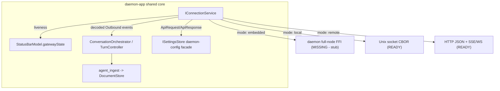
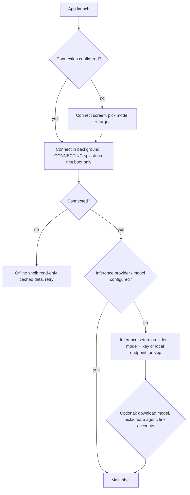
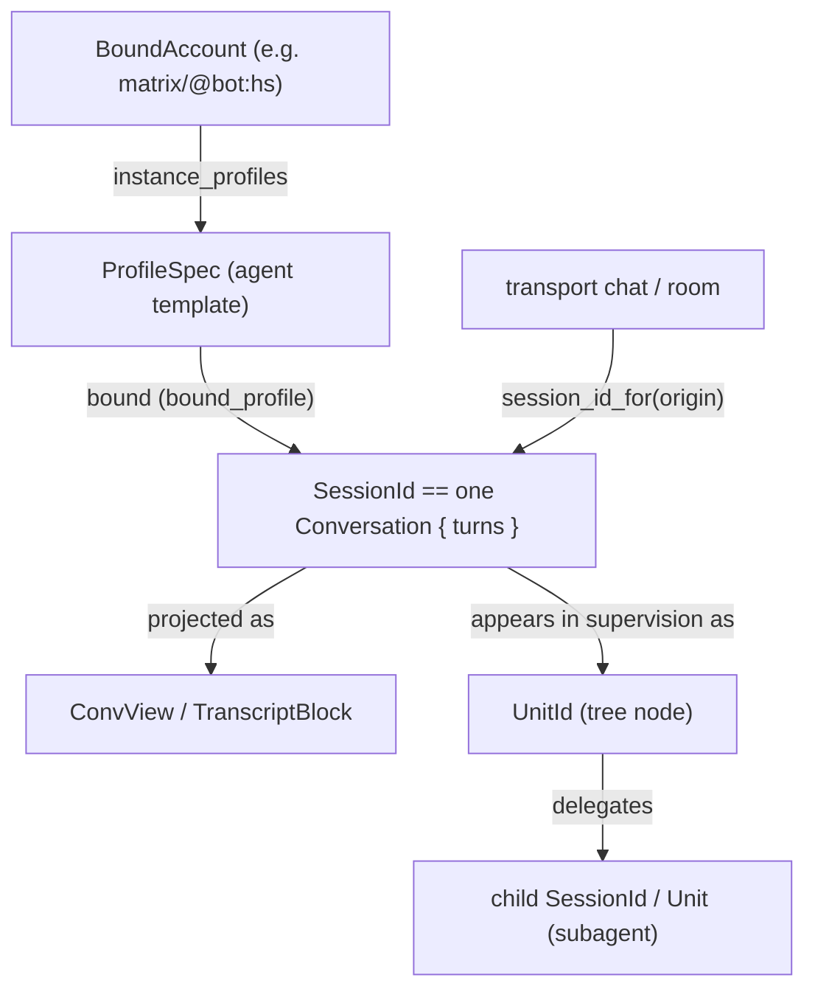

# First-run / connection / settings audit map: daemon-app vs `../daemon` NodeApi

Status: historical pre-integration snapshot. First-run, connection, settings,
and several manager surfaces now exist in `daemon-app` behind mock/local-dev
services; use this document as integration context rather than exact current
state.

Companion to [feature-coverage-audit.md](feature-coverage-audit.md). Where that audit covers the
**core chat loop**, this one covers the **shell around it**: how a front end connects to a
`daemon` node, what the user sees on **first run**, and how **settings/config** (providers,
models, agents/profiles, ACP, app preferences) should be organised as shared GUI + TUI logic.

This is an audit + integration-simulation map. Some UI described here has since
been built; the remaining goal is to keep the seams clear so wiring the real
`daemon` becomes a data-source swap, and to surface where `../daemon` is missing
functionality the client needs.

## Method

Four surfaces were inventoried (same approach as the core-loop audit):

- daemon-app GUI: `src/DaemonApp/**` + `src/core/**`.
- daemon-app TUI: `src/tui/**` (reuses the GUI's C++ view-models).
- `../daemon` backend: the Rust workspace, especially the `NodeApi` surface in
  `crates/contracts/daemon-api/` and its implementation in `crates/substrate/daemon-host/`.
- Reference product: hermes-agent desktop (`apps/desktop`, Electron+React) and TUI (`ui-tui`,
  Ink) at `../daemon-hermes/hermes-agent/`, plus the predecessor Qt app
  `../daemon-q1-2026/apps/daemon/` for its mature model-management UI.

### Decision baseline (confirmed scope)

- **Transport**: design the connection picker for **all three modes** - embedded (in-process
  FFI), local Unix-domain socket, and remote - but treat **Unix-socket CBOR as the near-term
  primary** (it is the only fully-built full-node transport today). Full-node embedded FFI is a
  flagged `../daemon` workstream (see Gaps).
- **Deliverable**: this single map; the seams it proposes (`IConnectionService`,
  `ISettingsStore`, a NodeApi client) are a follow-up implementation, not part of this pass.

## Verdict

The backend is much further along than the front end on this axis. `../daemon` already exposes a
rich, well-factored `NodeApi` (six sub-traits, ~80 wire RPCs) covering sessions, control,
models, profiles, credentials, and interactive auth - most of what a first-run + settings flow
needs. daemon-app, by contrast, has **no connection layer, no first-run, and no config beyond
GUI-only appearance preferences**. The status bar already *models* a gateway connection state
but nothing ever sets it.

So the work is overwhelmingly **front-end + a thin client adapter**, not backend feature work.
The few genuine backend gaps (full-node FFI, a provider-registry API, ACP discovery,
`subagent.*` events) are enumerated in [Daemon gaps to flag](#10-daemon-gaps-to-flag) so they
can be scheduled in tandem.

The highest-leverage move mirrors the core-loop audit's finding: a seam already has the right
shape (`StatusBarModel.gatewayState`) but nothing feeds it. Build the connection + settings
**models once in shared C++**, render them in both front ends, and keep the daemon swap to a
single adapter.

---

## 1. Current state (what exists today)

### daemon-app

- **No connection layer.** There is no `NodeApi` client, no socket code, no FFI binding. The
  only references to the daemon are planning comments at the intended seams
  (`conversation_orchestrator.h` "daemon NodeApi adapter", `agent_ingest.h` "daemon
  Unix-socket/FFI feed plugs in here unchanged").
- **No first-run / onboarding.** The app boots straight into the three-pane shell with seeded
  in-memory data. The only "empty" affordances are the empty-thread welcome in
  [Transcript.qml](../src/DaemonApp/Transcript/Transcript.qml) and "Select a conversation" in
  `Conversation.qml`. No `firstRun` / `setupComplete` flag exists.
- **Config is GUI-only appearance prefs.** [`UiSettings`](../src/DaemonApp/Settings/uisettings.cpp)
  persists `ui/*` keys via `QSettings` (theme, fonts, font size, layout toggles). There is **no**
  `ISettingsStore` in `src/core`, no config file, no profiles, no daemon-config concept. The TUI
  shares only `ui/theme` via its own ad-hoc `QSettings("daemon-app","daemon-app")`.
- **Settings is a popup, not a page.** The tab-bar `...` opens `SettingsMenu.qml`; the sidebar
  cog opens a theme-swatch popup. `TabModel` *supports* page tabs (`Settings = 1` via
  `openPage()`), but nothing calls `openPage(Settings)` in either front end.
- **A connection model already exists, unfed.** `StatusBarModel` already declares the gateway
  state vocabulary the daemon will drive:

```19:24:/home/j/experiments/daemon-app/src/DaemonApp/StatusModel/status_bar_model.h
class StatusBarModel : public QObject {
    Q_OBJECT
    QML_ELEMENT

    // "ready" | "needs setup" | "checking" | "connecting" | "offline".
    Q_PROPERTY(QString gatewayState READ gatewayState WRITE setGatewayState NOTIFY gatewayStateChanged)
```

  It also already carries `tokensIn/Out`, `usdCost`, `rateRemaining/rateLimit`, and
  `contextUsed/Max` - i.e. the exact fields the daemon's `Usage`/`Context`/`RateLimit` events
  carry - but defaults are static placeholders and nothing sets `gatewayState`.

### `../daemon` backend

The node surface is a composition of six sub-traits:

```835:839:/home/j/experiments/daemon/crates/contracts/daemon-api/src/lib.rs
pub trait NodeApi:
    SessionApi + ControlApi + ModelApi + ProfileApi + CredentialApi + AuthApi
{
}
impl<T: SessionApi + ControlApi + ModelApi + ProfileApi + CredentialApi + AuthApi> NodeApi for T {}
```

| Sub-trait | Role | First-run / settings relevance |
|-----------|------|-------------------------------|
| `SessionApi` | submit/poll/respond, live log, session overlay/model/mode | per-session model + mode overrides |
| `ControlApi` | health/stats/telemetry, sessions, fleet tree, approvals, checkpoints | connection health, subagent tree |
| `ModelApi` | HF search/download, catalog, activate, quantize | the Models hub |
| `ProfileApi` | profile CRUD, clone, import/export, skills, curator | agent/profile setup |
| `CredentialApi` | set/list/remove API keys (redacted list) | provider keys |
| `AuthApi` | interactive SSO/OAuth (Matrix, OAuth2+PKCE) | family-agnostic account login (see §5.2) |

Defined in `crates/contracts/daemon-api/src/lib.rs`; implemented as `NodeApiImpl` in
`crates/substrate/daemon-host/src/node_api.rs`; CBOR wire mirror (`ApiRequest`/`ApiResponse`)
dispatched by `daemon_api::dispatch()`.

---

## 2. Connection model

### 2.1 The three transports

| Mode | Backend status | Wire | Notes |
|------|----------------|------|-------|
| **Embedded (in-process)** | direct trait call EXISTS; **full-node C FFI MISSING** | trait / CBOR | `daemon-core-ffi` is **session-only** (`dispatch_session`, no control plane). Full-node `daemon-ffi` is a **stub**. A single-process GUI+daemon needs this gap closed (or to link the node crate directly). |
| **Local Unix socket** | EXISTS (primary) | length-framed **CBOR** | `serve_api_unix` + `ApiClient` in `crates/substrate/daemon-host/src/socket.rs`. Socket path `$DAEMON_API_SOCKET` or `$TMPDIR/daemon-api.sock`. This is what `daemon-cli` uses; the recommended near-term client path. |
| **Remote** | EXISTS (optional) | **HTTP JSON + SSE/WS** | `crates/adapters/daemon-http`: `POST /api`, `GET .../subscribe` (SSE), `GET .../ws`. Enabled via `DAEMON_HTTP_ADDR`. No CBOR-over-TCP NodeApi server exists, so remote = HTTP/JSON. |

Serialization differs by transport (CBOR for socket/FFI, JSON for HTTP), so the client adapter
must abstract codec as well as transport.

### 2.2 Proposed seam: `IConnectionService` (shared core)

Add a transport-agnostic connection service in `src/core` (sibling to
`IConversationStore` / `IPlatformServices`), owning:

- **The active connection** to a node (one of the three modes), with config: mode, socket path
  / URL, auth (token vs OAuth), profile.
- **A request channel** (`request(ApiRequest) -> ApiResponse`) and an **event/log subscription**
  (`subscribe(session, after_seq)` -> stream of `Outbound`).
- **A liveness state machine** that drives `StatusBarModel.gatewayState`
  (`checking -> connecting -> ready` / `offline` / `needs setup`).
- **Reconnect** with backoff (mirrors hermes desktop's sleep/wake + visibility reconnect; the
  full-screen CONNECTING overlay is **initial-boot only**, never on reconnect).

This is the single integration point the existing seams already anticipate: the
`ConversationOrchestrator`/`TurnController` event swap, the `agent_ingest` feed, and
`StatusBarModel` all consume **already-decoded event maps**, so the connection service decodes
`Outbound` once and fans out.



### 2.3 Connection status + disconnected behavior

- **Status bar** is the single surface for connection state. `StatusBarModel` already has
  `gatewayState`, `gatewayOffline`, `gatewayDegraded`, `gatewayTone`, plus the gateway dropdown
  fields (`gatewayConnectionText`, `gatewayLog`, `gatewayPlatforms`). The GUI `GatewayMenu.qml`
  and TUI `status_bar_view.cpp` already render these - they just need a live feed.
- **Read-only when disconnected** (the user's intent): cached conversations/transcripts remain
  browsable from the local store; new sends are blocked until `gatewayState == "ready"`. This
  matches hermes desktop (draft stays editable while reconnecting; submit disabled until the
  socket is open) and requires a **local cache** of transcript data (see §4.3).
- **No reconnect modal.** Reconnect happens in the background; the status bar reflects it.

### 2.4 Picking a backend (first-run + settings)

The connection picker is reachable in two places, sharing one model:

- **First run**, before the main shell (see §3).
- **Settings -> Connection** (the "Gateway" tab in hermes), for changing mode/URL/auth later.

Hermes' `gateway-settings.tsx` is the reference: mode cards (Local vs Remote), URL + auth, a
**Test connection** action, and OAuth sign-in/out. daemon-app adds a third **Embedded** card
(gated/disabled until full-node FFI lands).

---

## 3. First-run flow

### 3.1 Shape

Lighter than hermes' install-overlay stack (we have no Python runtime to bootstrap), but the
same logical phases. The gate is **catalog-driven** like the predecessor q1 app's
`OnboardingController` (onboarding needed iff there is no usable provider/model), cross-checked
with hermes' `setup.status` RPC pattern (`provider_configured`).



### 3.2 Phase detail

1. **Connect** - pick mode (embedded / local / remote) + target. Skipped if a saved connection
   exists. Maps to `IConnectionService` config.
2. **Connecting splash** - full-screen centered text on **initial boot only** (hermes
   `gateway-connecting-overlay.tsx` explicitly avoids covering the UI on later reconnects).
3. **Inference gate** - if `CredentialApi::credential_list` / `ModelApi::model_current` show no
   usable inference provider, present the inference setup (provider + model + a masked key via
   `credential_set`, or a local endpoint). A **"choose later"** skip dismisses it (hermes
   `dismissFirstRunOnboarding`), leaving the status bar in `needs setup`. Note this gate is about
   **inference only** - linking accounts (Matrix, OAuth families via `AuthApi`; see §5.2) is an
   opt-in action later, not a first-run blocker.
4. **Optional model / agent setup** - jump to the Models hub (`ModelApi`) and/or pick or create
   an agent/profile (`ProfileApi`). q1's `OnboardingController` deep-link pattern (monotonic
   request IDs that open a specific dialog after navigation) is the clean way to wire
   "navigate + open provider/model dialog".
5. **Main shell.**

### 3.3 Where it mounts

- **GUI**: gate in `Application` / `Main.qml` before the three-pane `SplitView`/`StackView`
  mounts; persist `setupComplete` (and last connection) via the new `ISettingsStore`.
- **TUI**: gate in `RootWidget` before the transcript view; the TUI can use a lighter
  panel-style gate (hermes TUI uses a "Setup Required" transcript panel rather than a wizard).
  Note the core-loop audit currently excludes a reachable settings/help entry point in the TUI -
  this first-run gate is the natural place to add the minimal TUI entry.

---

## 4. Settings / config architecture

### 4.1 Two config domains

The single biggest structural decision: split config cleanly.

| Domain | Lives | Backed by | Examples |
|--------|-------|-----------|----------|
| **App preferences** (client-local) | client | new `ISettingsStore` (lift `UiSettings`) | theme, fonts, layout, notifications, connection target, `setupComplete` |
| **Daemon config** (node-authoritative) | `../daemon` | `NodeApi` RPCs | providers/credentials, models, profiles/agents, session model/mode/overlay, MCP, cron |

App prefs persist locally and work offline. Daemon config is **read/written over the wire** and
unavailable (read-only/last-known) when disconnected.

### 4.2 Proposed seam: `ISettingsStore` (shared core)

Today `UiSettings` is a GUI-side singleton and the TUI re-reads `ui/theme` by hand. Lift a
**shared** `ISettingsStore` into `src/core` (like `IConversationStore`), so both front ends bind
one model. Keep the daemon-config facade thin: a typed wrapper over `IConnectionService` requests
(e.g. `providers()`, `setCredential()`, `profiles()`, `models()`), so settings pages never speak
CBOR/JSON directly.

### 4.3 Local cache (enables read-only offline)

The user wants previous chats/transcripts accessible offline. Today the only store is
`InMemoryConversationStore`. A durable local cache (the `persistence/README` SQL plan, currently
aspirational) should back `IConversationStore` so transcripts survive disconnection and restarts.
Daemon `session_history` / `log_after` hydrate it when connected; reads fall back to cache when
offline. This is orthogonal to settings but required for the disconnected UX in §2.3.

### 4.4 Navigation to settings (pages, not popups)

Move from the current popup to **page tabs**, which `TabModel::openPage` already supports:

- **GUI entry**: a settings cog with a context menu (the user's suggestion) is the cleanest -
  the sidebar cog currently only swaps theme. Options: cog context menu listing top-level
  sections, the tab-bar `...`, the command palette (already routes `"settings"`), and slash
  `/settings`. Settings then render as a **tabbed page** (hermes uses a split-pane overlay:
  left nav + right content, deep-linkable via `?tab=`).
- **TUI entry**: add a keybinding (the core-loop audit notes this is currently missing) opening
  the same `openPage(Settings)`; render the section list as a painter, reusing the shared model.

### 4.5 Settings page inventory

Adapted from hermes desktop's section list, tagged for *this* pass. Legend: **stub-now** =
buildable client-side behind seams pre-daemon; **wire** = exists in daemon, needs UI + adapter;
**defer** = blocked on a daemon gap.

| Section | Tag | Backing |
|---------|-----|---------|
| Appearance (theme/fonts/layout/language) | stub-now | `ISettingsStore` (lift `UiSettings`) |
| Notifications | stub-now | `IPlatformServices::notify` (already present) |
| Connection / Gateway (mode, URL, auth, test) | wire | `IConnectionService` + `AuthApi` |
| Model (main + per-task model, default) | wire | `ModelApi::models`/`model_current`, `SessionApi::set_session_model` |
| Models hub (search / download / installed) | wire | `ModelApi` (search/files/download/catalog/activate/quantize) |
| Inference provider key (per profile) | wire | `CredentialApi::credential_set/list/remove` |
| Accounts & Auth (Matrix + any auth family) | wire | `AuthApi` (`auth_providers`/`begin`/`complete`) + `ProfileSpec.bound_accounts` |
| Agents / Profiles (persona, skills, tools) | wire | `ProfileApi` + `ProfileSpec` |
| Chat (personality, reasoning display, image mode) | partly wire | `SessionApi::set_session_overlay` / profile tunables |
| Safety (approval mode, allowlist, redaction) | partly wire | `SessionApi::set_session_mode`, profile policy |
| Memory & Context (engine, compression) | wire | profile `context_engine` / `memory_provider` |
| Workspace (cwd, exec mode, shell) | defer | daemon tool/workspace config (launch-time today) |
| Voice (STT/TTS) | defer | not surfaced on NodeApi |
| MCP servers | defer | configured at launch; no runtime MCP RPC |
| Advanced (toolsets, delegation limits) | partly | `ProfileSpec.tool_allowlist`; no runtime tool-registration API |
| Archived chats | stub-now | `IConversationStore` |
| About / Updates | stub-now | `IPlatformServices::checkForUpdates` (declared, no-op) |

---

## 5. Inference providers, accounts & auth

These are **two distinct concerns** that my first pass wrongly merged. `CredentialApi` and
`AuthApi` are not "the providers screen" - they are the node's general **secret + account**
surface. An inference provider (which LLM backend a profile runs on) is a *consumer* of that
surface; a logged-in **account** (Matrix, an OAuth2 IdP, ...) is another. Both store blobs in the
same `CredentialStore`. The GUI/TUI should therefore have a **general Accounts & Auth surface**,
not a Matrix-specific one, with inference-provider keys as one (simple) case.

### 5.1 Inference providers (which LLM backend a profile uses)

- **Provider selection** is `ProfileSpec.provider`:

```22:49:/home/j/experiments/daemon/crates/contracts/daemon-api/src/profile.rs
pub enum ProviderSelector {
    Mock,
    #[serde(rename = "genai", alias = "openai", alias = "anthropic", alias = "gemini", ...)]
    GenAi,
    LlamaCpp,
    MistralRs,
}
```

  `GenAi` (via the `genai` crate) infers the cloud adapter from the model name - OpenAI,
  Anthropic, Gemini, Groq, DeepSeek, xAI, OpenRouter, Cohere, Ollama, etc. - so the UI does not
  need a per-cloud provider type; `LlamaCpp`/`MistralRs` are the local engines.
- **The API key** is just a secret in the credential store: `CredentialApi::credential_set(profile,
  secret)` writes the secret keyed by a **credential-ref** (defaults to the profile id), which the
  node's credential authority provisions onto each model request (`Request.auth`). `credential_list`
  returns redacted `CredentialInfo { profile, present, hint }` (a masked last-four hint, never the
  secret). So "set an inference key" is a one-field masked form over `credential_set`.

**Gap (unchanged)**: there is **no dedicated `ProviderApi`**. Inference-provider availability is
implied by credentials + profile + model catalog; the launch-time `ProviderRegistry` builders are
frozen at node assembly. Runtime "add a provider type" (like q1's `ProviderInstanceStore`) is not
expressible on the wire. For cloud-by-key this is fine; for richer provider management it is a gap.

### 5.2 Accounts & auth (what identities/services an agent can act as)

This is the surface the user flagged. `AuthApi` is a **family-agnostic, client-driven login seam**
(the host module is documented as "family-agnostic: a transport/provider family (matrix, an OAuth2
IdP, ...)" and keeps a per-family `AuthFactory` **registry**). Matrix is one registered family, not
a special case - **do not overfit the UI to it**.

The model, in daemon terms:

- An **account** = an authenticated identity on a transport/provider family, produced by an auth
  flow, stored as a session blob in the `CredentialStore`, and **bound to a profile** so an agent
  can act as it. The binding is `BoundAccount`:

```120:125:/home/j/experiments/daemon/crates/contracts/daemon-api/src/profile.rs
pub struct BoundAccount {
    /// The instance-qualified transport id this account speaks as (e.g. `matrix/@bot:hs.org`).
    pub transport_instance: String,
    /// The credential ref naming the account's stored session blob (a name, never the secret).
    pub credential_ref: String,
}
```

- A profile carries `bound_accounts: Vec<BoundAccount>`; `AuthBindRequest` lets a completed login
  attach itself to a profile automatically.

**The flow (client-driven, daemon owns no browser):**

1. `auth_providers()` -> `Vec<AuthProviderInfo>` = **capability discovery**. Each entry has
   `family`, `flow_kind` (`MatrixSso` | `OAuth2Pkce`), `display_name`, and a
   `params_schema: Vec<AuthParamField { key, label, required }>`. **The client renders the form
   dynamically from `params_schema`** - this is the anti-overfit mechanism. Matrix advertises
   `homeserver` (+ optional `idp_id`); an OAuth2 IdP advertises its own fields. The UI hardcodes
   none of them.
2. `auth_begin(AuthBeginRequest { family, params, redirect_uri, bind })` -> `AuthBeginResponse {
   flow_id, authorization_url, redirect_uri, expires_at, flow_kind }`. The **client owns
   `redirect_uri`** (a loopback URL or a custom-scheme deep link) and opens `authorization_url` in a
   browser.
3. Client captures the redirect callback and relays it: `auth_complete(AuthCompleteRequest {
   flow_id, callback })` -> `AuthCompleteResponse { credential_ref, account_label (e.g.
   @user:hs.org), transport_instance (e.g. matrix/@bot:hs.org), bound_profile }`. The daemon writes
   the credential and (if requested) edits the profile's `bound_accounts`.
4. `auth_cancel(flow_id)` on abort (idempotent).

**GUI/TUI design implications:**

- Build **one generic "Add account" wizard** keyed off `auth_providers()`: pick a family ->
  render `params_schema` form -> branch on `flow_kind` for redirect capture -> confirm
  `account_label` -> optionally bind to a profile. Matrix SSO is exercised as the first family but
  the wizard stays generic, so adding a future OAuth2 IdP is zero new UI.
- **Redirect capture** is the platform-specific part:
  - GUI desktop: a loopback HTTP listener on `127.0.0.1:<port>` (the `redirect_uri`) or a
    registered custom-scheme deep link; open the system browser; capture `code`+`state` (PKCE) or
    `loginToken` (Matrix SSO).
  - TUI: no embedded browser. Either run the same loopback listener and print "open this URL", or
    fall back to **paste-the-callback-URL** (hermes TUI hands OAuth to the CLI / pastes the code).
    Flag this as a real design decision (see Gaps).
- **Accounts list UI**: enumerate per profile from `ProfileSpec.bound_accounts` joined with
  redacted `credential_list`; show `account_label` + family + masked hint; actions = add (wizard),
  remove (`credential_remove` + drop the `bound_account`), re-auth (re-run the flow).
- **Matrix sign-in specifically**: it is just `family: "matrix"`, `flow_kind: MatrixSso`,
  `params: { homeserver, idp_id? }`, redirect carrying a single-use `loginToken`. Getting it right
  = getting the generic wizard + loopback/paste capture right; no Matrix-only code path.

**Settings placement**: a dedicated **Accounts & Auth** section (distinct from the inference
**Model/Providers** section), reused by the first-run gate only insofar as inference setup is
required to chat - account linking (Matrix, etc.) is an opt-in post-setup action, not a first-run
blocker.

---

## 6. Models

- Full **`ModelApi`** on NodeApi, implemented by `daemon-models::ModelManager`: `model_search`
  (HF), `model_files`, `model_download` (pause/resume/cancel), `model_catalog`, `model_delete`,
  `model_activate`, `model_recommend`, `model_quantize`, `model_inspect`, `models`,
  `model_current`. This already matches the q1 Models hub's feature set.
- **Reuse the q1 UI, swap the data source.** The predecessor app
  (`../daemon-q1-2026/apps/daemon/`) has a mature Models hub - Discover (HF gallery search with
  infinite scroll + parameter-size filter), Downloads (multi-job queue with pause/resume/cancel
  via HTTP Range + `.part` files), Installed (per-model llama settings), and Providers. The
  porting recommendation: keep the **QML/UX** (`DiscoverModelsSubpage.qml`, `DownloadsPage.qml`,
  installed/details popups) and the VM shapes, but back them with **`ModelApi` calls** instead of
  q1's direct `HuggingFaceService` / `DownloadManagerService` (the daemon now owns HF access,
  staging, split-GGUF merge, and the catalog). This avoids duplicating download/merge logic
  client-side and keeps the cache server-authoritative (`DAEMON_MODELS_CACHE_DIR`).
- Note: **hermes has no model-downloader** (it only points at OpenAI-compatible endpoints), so
  this hub is a daemon-app/q1 strength with no hermes reference - lean on q1.

---

## 7. Agents / profiles / ACP

### 7.1 Profiles = agents

`ProfileSpec` is the agent configuration unit (the hermes `config.yaml` + persona analogue):

```143:187:/home/j/experiments/daemon/crates/contracts/daemon-api/src/profile.rs
pub struct ProfileSpec {
    pub id: String,
    pub provider: ProviderSelector,
    pub model: String,
    pub base_url: Option<String>,
    pub system_prompt: String,           // persona (SOUL.md equivalent)
    pub tool_allowlist: Option<Vec<String>>,
    pub budget: BudgetSpec,
    pub tunables: EngineTunables,
    pub context_engine: ContextEngineSel,
    pub memory_provider: MemoryProviderSel,
    pub credential_ref: Option<String>,
    pub fallback_credential_ref: Option<String>,
    pub bound_accounts: Vec<BoundAccount>,
}
```

- **`ProfileApi`** implements list/get/create/update/delete/select/clone/export/import/history +
  skill revision + curator ops; persisted under `<data_dir>/profiles/`.
- **SOUL.md** is **not** a file concept in the daemon - it maps to `ProfileSpec.system_prompt`.
  The agent editor's "SOUL.md" textarea (hermes profiles UI) edits this field. Skills are a
  separate index (`daemon-skills` + curator); tools are an **allowlist** over launch-registered
  tools.
- **Session <-> profile binding is PARTIAL/implicit**: routing resolves a profile from origin +
  `bound_accounts` + active default (`submit_routed`); there is no explicit
  "open session with profile X" field on `Submit`. Worth confirming with backend before building
  an "open chat as agent X" affordance.

### 7.2 ACP agents (answering the user's question)

How does `daemon` become aware of available ACP agents? **It does not auto-discover them.** ACP
is a *foreign agent* protocol the daemon **hosts** as engine leaves; a foreign backend is spawned
from an explicit launch spec:

```44:53:/home/j/experiments/daemon/crates/adapters/daemon-acp/src/lib.rs
pub struct AcpLaunch {
    pub program: PathBuf,
    pub args: Vec<String>,
    pub env: Vec<(String, String)>,
    pub cwd: PathBuf,
}
```

Selected via `ForeignProtocol::Acp` in the node's `LaunchProfile` when delegating. Consequences
for the client:

- There is **no NodeApi to list / register / discover ACP agents**, and ACP sessions report
  `rewindable: false`. So a GUI "pick an available ACP agent" picker has **nothing to enumerate**
  today - this is a flagged gap. The interim is a manual "add ACP agent" form (program/args/env)
  that writes a launch spec, plus a future daemon-side registry/discovery RPC.
- hermes has **zero ACP UI** (no reference to copy), so this is greenfield.

---

## 8. Conversations / persistence (offline context)

Recap relevant to first-run/offline (full detail in the core-loop audit):

- Live session is a `daemon-core` actor; the merged log is append-only `SessionLogEntry` with
  monotonic `seq`. Durable reads via `session_history`/`unit_history` (`JournalPageView`, with a
  `verified` flag); live via `log_after`/`subscribe` (cursor-based, multi-consumer) vs `poll`
  (destructive drain - the client should prefer `subscribe`).
- Conversation **rewind** exists (`RewindTo` -> `Rewound`); workspace **checkpoints** are
  separate (`ControlApi::checkpoints`/`checkpoint_rewind`). The client's existing rewind seam
  already aligns.
- For offline read-only, hydrate the local cache (§4.3) from `session_history`.

---

## 9. NodeApi <-> UI mapping

### 9.1 Events (daemon -> client)

Events ride on `Outbound = Event(AgentEvent) | Request(HostRequest)`.

| Daemon event | daemon-app target | Status |
|--------------|-------------------|--------|
| `Usage { delta }` | `StatusBarModel` tokensIn/Out, usdCost | field exists, unfed |
| `Context { status }` | `StatusBarModel` contextUsed/Max | field exists, unfed |
| `RateLimit { snapshot }` | `StatusBarModel` rateRemaining/Limit | field exists, unfed |
| `TurnStarted/Finished` | `TurnController` / status busy+timer | mock today |
| `TextDelta`/`ReasoningDelta`/`ContentDelta` | transcript via `agent_ingest` | mock today |
| `ToolStarted`/`ToolFinished` (`ToolCallView`/`ToolResultView`) | tool blocks | mock today; **no dotted `tool.*` namespace** |
| `Rewound` | rewind seam | aligned |
| `HostRequest::{Approval,Input,Choice,Delegate}` | HITL surfaces / `InteractiveTurnHost` | mock host today |
| subagent progress | `SubagentModel` / fleet tree | **no `subagent.*` event**; use `ControlApi::tree`/`unit_outbound` |

### 9.2 Requests (client -> daemon), by settings surface

| Surface | RPCs |
|---------|------|
| Connection/health | `ControlApi::health`/`stats`/`sessions`/`tree` |
| Inference provider key | `CredentialApi::credential_set/list/remove` |
| Accounts & Auth (Matrix + any family) | `AuthApi::auth_providers/auth_begin/auth_complete/auth_cancel`; binds via `ProfileSpec.bound_accounts` |
| Models hub | `ModelApi::model_search/model_files/model_download/model_catalog/model_activate/model_delete/models/model_current` |
| Agents/profiles | `ProfileApi::profile_list/get/create/update/delete/clone/export/import` |
| Per-session | `SessionApi::set_session_model/set_session_mode/set_session_overlay` |
| Approvals | `ControlApi::approvals_pending/approval_decide` |

---

## 10. Daemon gaps to flag

Functionality the client first-run/settings flow wants that `../daemon` does not (fully) expose.
Each tagged **blocking** (a planned client surface cannot ship without it) or **nice-to-have**.

| Gap | Impact | Tag |
|-----|--------|-----|
| **Full-node embedded FFI** (`daemon-ffi` is a stub; only session-level `daemon-core-ffi` exists) | The "embedded daemon via FFI" connection mode has no backend. Either finish full-node FFI or link the node crate in-process. | blocking (for embedded mode) |
| **ACP discovery / registry API** | No way to enumerate or register available ACP agents; launch is explicit `program/args/env` only. Blocks an "available ACP agents" picker. | blocking (for ACP UI) |
| **Auth redirect capture is client-owned** (not a daemon gap, a client design decision) | `AuthApi` requires the client to own `redirect_uri` and capture the callback. GUI needs a loopback listener or custom-scheme deep link; the **TUI has no browser** and needs a loopback-or-paste fallback. Decide per front end before building the Accounts wizard. | blocking (for account login, esp. TUI) |
| **`subagent.*` wire events** | Subagent/delegation progress must be derived from `ControlApi::tree`/`unit_outbound` polling rather than a stream. | nice-to-have |
| **`ProviderApi`** (runtime provider-registry mutation) | Provider builders are frozen at node assembly; can't add/configure provider *types* at runtime (cloud-by-key still works). | nice-to-have |
| **Runtime tool-registration API** | Tools are launch-time policy; only `tool_allowlist` is dynamic. Advanced "toolsets" settings are read-mostly. | nice-to-have |
| **Explicit profile-on-session binding** | "Open chat as agent X" relies on routing config, not a `Submit { profile }` field. | confirm w/ backend |
| **Remote CBOR / JSON-RPC NodeApi** | Remote = HTTP/JSON only; no CBOR-over-TCP. Client adapter must support both codecs. | accepted constraint |
| **App-config RPC** | No NodeApi to read/write the daemon's TOML; node config is startup-only (env/file). Client cannot edit node-launch config remotely. | nice-to-have |
| **Fleet/tree is poll-only** | No subscribe/stream for tree changes; the sidebar fleet must poll `tree()` (+ `sessions()`). No incremental `TreeEvent` deltas. | nice-to-have |
| **`pause`/`resume`/`scale` unsupported on durable units** | Defined on `ControlApi` but `FleetViewImpl` returns `Unsupported`; only meaningful on live `FleetRuntime` orchestrator sub-fleets. | nice-to-have |
| **No profile/agent label on `UnitNode`** | The tree DTO carries id/kind/state/work/usage but not the bound profile; the fleet sidebar must join `profile_get`/session metadata to show "which agent". See §13.1. | nice-to-have |
| **Session roster is under-expressive** | `SessionInfo { session, state, rewindable }` has no profile/title/last-activity and `sessions()` omits unassigned interactive chats, so "my conversations grouped by agent" cannot be rendered. Needs enriched + unified roster (§13.0/13.2). | blocking (for conversation list/fleet) |
| **No chat -> session binding** | `session_id_for` is deterministic with no `(transport, chat) -> SessionId` pin table; users can't pin/move a DM or map N chats to one session, and there's no room enumeration. Needs a `ChatRoute` store + `routing_*` RPCs + `transport_rooms` (§13.5). | blocking (for transport routing UI) |
| **Routing registry does not hot-reload** | `RoutingRegistry` is built once at assembly; profile/auth binds made at runtime don't take effect until restart. Needs hot-reload on `profile_update`/auth bind (§13.5). | nice-to-have |
| **Checkpoint <-> conversation-rewind not unified** | Conversation rewind (seal + best-effort workspace rollback) and `checkpoint_rewind` (files only) are separate, and the managed path skips seal/rollback. Needs a unified `rewind(RewindPoint)` + transcript<->checkpoint linkage (§13.3). | nice-to-have |
| **Planned cron / scheduling RPC** | The daemon will gain cron functionality (it isn't implemented yet); today only the internal activation/wake/outbox substrate exists. A "scheduled jobs" manager needs the forthcoming `CronApi` (§13.9) and can be stubbed client-side now. | PLANNED (daemon work pending) |

---

## 11. GUI / TUI parity

Per the core-loop audit's principle ("build the model once, render twice"), parity cost is a
painter, not a second state implementation. Recommended split:

- **Shared model, both front ends**: `IConnectionService` + `StatusBarModel.gatewayState`
  (connection status), the provider/model picker view-models, the **generic Accounts & Auth
  wizard model** (driven by `auth_providers()` capability discovery, so it is one model for
  Matrix and every future family), the first-run gate state, the `ISettingsStore`.
- **GUI-rich, TUI-minimal**: full tabbed settings pages and the Models-hub Discover/Downloads UI
  are GUI-first; the TUI gets a connection-status line, a provider/model picker overlay (hermes
  TUI's `modelPicker.tsx` pattern: provider -> key -> model), and a minimal settings entry
  (currently excluded - this map adds the rationale to include it).
- **Per-front-end (auth redirect capture)**: the Accounts wizard's redirect step differs - GUI
  loopback/deep-link vs TUI loopback-or-paste (see §5.2 and Gaps). Keep the wizard *state* shared;
  only the capture step is front-end-specific.
- **Desktop-only**: OS notifications for approvals (`IPlatformServices::notify`), tray, autostart.

---

## 12. Recommended sequencing

Pre-daemon (stub-now, behind the new seams):

1. `ISettingsStore` in `src/core` (lift `UiSettings`; both front ends bind it).
2. `IConnectionService` skeleton + state machine driving `StatusBarModel.gatewayState`
   (fed by a mock initially, exactly like `TurnController`).
3. First-run gate (connect -> inference gate -> shell) with `setupComplete` persistence; GUI in
   `Application`/`Main.qml`, minimal TUI panel in `RootWidget`.
4. Settings as `openPage(Settings)` tabbed page + cog context-menu entry; wire Appearance,
   Notifications, Archived (all stub-now).
5. Durable local conversation cache to back `IConversationStore` (enables read-only offline).

On first real integration (Unix-socket CBOR adapter):

6. Replace the mock connection with the CBOR `ApiClient` (mirror `daemon-cli`); decode `Outbound`
   once and fan out to `StatusBarModel` / `ConversationOrchestrator` / `agent_ingest`.
7. Inference setup (CredentialApi key form) + Models hub (ModelApi, porting q1 UI) settings pages.
8. Generic Accounts & Auth wizard (AuthApi capability discovery; Matrix SSO as the first family,
   no Matrix-only path) + per-front-end redirect capture.
9. Agents/profiles (ProfileApi) editor, incl. `bound_accounts` management.

In tandem with backend (flagged gaps):

10. Full-node FFI -> embedded mode; ACP discovery RPC -> ACP picker; `subagent.*` events ->
    live delegation rows; HTTP/JSON codec -> remote mode.

## 13. Managers / pickers and the daemon object model

The sections above cover first-run, connection, settings, providers, accounts, models, and
profiles. This section gives full treatments of the remaining **managers/pickers**. Because
daemon-app is largely stubbed UI data structures, each will **query (and cache)** its data from
`daemon`; where the live daemon model is not expressive enough to represent what the client intends
to show, the gap is flagged with the concrete NodeApi shape `daemon` would need (consolidated in
13.10). Each surface uses one template: **Intent** / **Hermes today + how we beat it** / **Daemon
mapping (verdict)** / **Gap -> proposed shape**. See the
[fleet/supervision exploration](79e7ac7e-b029-4f30-9bc9-cc98fd194e7e) for the underlying type map.

### 13.0 Core object model (and the session == conversation question)

The whole map hinges on four daemon concepts and how they relate:



- **Confirm (session == conversation):** one `SessionId` owns exactly one `Conversation { turns }`
  ([conversation.rs](/home/j/experiments/daemon/crates/engine/daemon-core/src/conversation.rs)),
  projected to clients as `ConvView` / coalesced `TranscriptBlock`s. A conversation transcript *is*
  a session's turn log. **Verdict: MATCHES at the container level.**
- **Refute (`sessions()` == my conversation list):** `ControlApi::sessions()`
  ([node_api.rs](/home/j/experiments/daemon/crates/substrate/daemon-host/src/node_api.rs)) lists
  only **durable `session_record` rows**; interactive `submit`/`poll` chats are absent until
  `assign`, and `SessionInfo { session, state, rewindable }` has **no profile or title**. The
  user-facing "my conversations" list is not directly available. **Verdict: PARTIAL.**
- **Catch (no agent instance):** there is no first-class "agent" that owns many conversations -
  only `ProfileSpec` (template), `SessionId` (run/conversation), and `UnitId` (tree node). Grouping
  conversations under "Agent X" has nothing to group by today.
- **Gap -> proposed shape:** enrich `SessionInfo { ..., bound_profile: Option<ProfileRef>, title:
  Option<String>, last_activity_ms: u64, lifecycle: Live | Durable }`; add
  `ControlApi::session_get(SessionId) -> SessionDetail`; make the roster **unified** (live +
  durable). `bound_profile` already exists in the store (`SessionMeta`) - it is just not on the wire
  DTOs.

### 13.1 Fleet / supervision tree

- **Intent:** a sidebar tree of agents and their live work, with a user's conversations grouped
  under the agent that owns them. daemon-app already has the right shape: `domain::AgentNode`
  ([agent_node.h](../src/core/domain/agent_node.h)) is documented as "mirroring
  `daemon_api::UnitNode`", and `SidebarModel`
  ([sidebar_model.h](../src/DaemonApp/Sidebar/sidebar_model.h)) flattens it to an arbitrary-depth
  tree - but it is fed by the **mock `IConversationStore::agentChildren`**.
- **Hermes today + how we beat it:** an Agents overlay showing only the **current session's
  subagent tree** (a live monitor), plus the sidebar profile rail; no persistent agent-org tree. We
  beat it by unifying "fleet org" and "live runs" in one sidebar (contingent on node labelling -
  see gap).
- **Daemon mapping:** `tree() -> TreeReport { root, nodes: Vec<UnitNode { id, kind, state, work,
  usage, children }> }` is a **poll-only supervision projection**
  ([runtime.rs](/home/j/experiments/daemon/crates/orchestration/daemon-orchestration/src/runtime.rs)).
  Drill-in: `unit_history` (durable transcript), `unit_outbound` (live only; empty for durable).
  Lifecycle: `assign`/`cancel` by `SessionId`; `pause`/`resume`/`scale` by `UnitId` but
  **`Unsupported` on durable nodes**. **Verdict: PARTIAL** - the tree exists, but cannot express
  agent identity, conversation grouping, or a stable title.
- **The modelling decision (must be made before wiring):** the sidebar tree currently doubles as a
  **conversation-organisation structure** (`ListScope::Node` folds a node's subtree to filter the
  conversation list; roots are user-authored via `createRootNode()`), whereas `tree()` is **live
  running units** with no profile label. Options: (a) profiles-as-roots (from `profile_list`) with
  sessions/subagents nested (recommended; needs profile-on-node + a profile->sessions index); (b)
  pure live `tree()` monitor (drop user-authored roots); (c) two distinct surfaces (a persistent
  "Fleet" org vs a live "Agents" monitor). Recommendation: (a), contingent on the gap below.
- **Gap -> proposed shape:** add `profile: Option<ProfileRef>`, `session: Option<SessionId>`,
  `title: Option<String>`, and `role: Primary | Subagent` to `UnitNode`; add a **tree
  subscription** (`ControlApi::tree_subscribe() -> Stream<TreeEvent>`, or fleet-level push) to
  replace polling; and a profile-indexed roster (`ControlApi::sessions_by_profile() ->
  Map<ProfileRef, Vec<SessionInfo>>`) or the agent-instance concept from 13.0.

### 13.2 Sessions / activity (= conversations)

- **Intent:** the conversation list **is** the session list - the turns between a user and an
  agent - plus an "activity" view of which sessions are live, suspended, or completed, with
  resume/cancel.
- **Hermes today + how we beat it:** a Ctrl+X session switcher and Command Center -> Sessions (a
  flat list with hover-only pin/export/delete). We beat it with first-class session state and inline
  resume of suspended work.
- **Daemon mapping:** `sessions() -> Vec<SessionInfo>` with `SessionState = Active | Suspended {
  job_id } | Ready | Completed | Unknown`; resume a suspended session via `assign`, stop via
  `cancel`. **Verdict: PARTIAL** - same roster-enrichment gap as 13.0 (no profile/title; interactive
  chats missing until assigned).
- **Gap -> proposed shape:** the enriched/unified `SessionInfo` + `session_get` from 13.0 (this is
  the same surface rendered as a list rather than a tree).

### 13.3 Checkpoints vs conversation rewind

- **Intent:** the user asked whether "rewind the conversation" and "restore the workspace" should
  be one thing - ideally a single "rewind to point T" that puts both the transcript and the files
  back.
- **Daemon mapping (two distinct mechanisms):**
  - **Conversation rewind:** `AgentCommand::RewindTo { anchor } -> AgentEvent::Rewound` truncates
    `Conversation.turns`, bumps the epoch, **seals the journal** (`JournalPageView.sealed_after`),
    and does a **best-effort workspace rollback** by restoring the §12 checkpoints of the dropped
    tool calls
    ([node_api.rs](/home/j/experiments/daemon/crates/substrate/daemon-host/src/node_api.rs)
    `rollback_workspace_after_rewind`).
  - **Workspace checkpoints:** `ControlApi::checkpoints(Option<SessionId>) -> Vec<CheckpointInfo>` +
    `checkpoint_rewind(session, id)` restore the **filesystem only**, taken before each mutating
    tool ([checkpoint.rs](/home/j/experiments/daemon/crates/engine/daemon-core/src/checkpoint.rs));
    they do **not** touch the transcript.
- **Verdict: COMPLEMENTARY, partially linked - not the same thing.** Conversation rewind already
  triggers workspace rollback; `checkpoint_rewind` is an independent file-only undo. Also flag an
  **inconsistency**: the fleet/managed path applies engine-level rewind only (no journal seal / no
  workspace rollback), so rewind behaves differently for live vs managed sessions.
- **Gap -> proposed shape (optional unification):** a single `ControlApi::rewind(session,
  RewindPoint { anchor, restore_workspace: bool })`, plus a stable transcript<->checkpoint linkage
  (add `turn_ordinal: u64` / `cursor: u64` to `CheckpointInfo`) so one "rewind to here" can
  optionally restore files; and make the managed path seal+rollback like the live path.

### 13.4 Skills library + curator (daemon is ahead of Hermes)

- **Intent:** a real skills manager - browse, read/edit SKILL.md, see revisions, pin/archive/
  restore, run the curator, and choose per-session vs global application.
- **Hermes today + how we beat it:** **toggle-only** - a flat enable/disable list
  ([apps/desktop/src/app/skills/index.tsx](/home/j/experiments/daemon-hermes/hermes-agent/apps/desktop/src/app/skills/index.tsx))
  with no curator UI, no SKILL.md viewer/editor, and an "applies to new sessions only" caveat; the
  curator is buried as an aux-model task + a hidden `/curator` slash. We beat it by surfacing the
  lifecycle the daemon already has.
- **Daemon mapping:** `ProfileApi` already exposes `skill_history` / `skill_at` (revisions) and
  `curator_list` / `curator_run` / `curator_pin` / `curator_unpin` / `curator_archive` /
  `curator_restore`. **Verdict: MATCHES (mostly EXISTS).**
- **Gap -> proposed shape:** the read/edit half is thin - add `skill_get(name) -> SkillBundle`
  (body + metadata) and `skill_put(name, body)` if in-app editing is wanted; surface the
  `curator_run -> Vec<CuratorChange>` output as a reviewable queue.

### 13.5 Transports / accounts / channel -> session binding

- **Intent (the user's ask):** bind accounts to agents, and bind specific chats/channels to
  specific sessions - "route this DM to this session", "these N chats -> one session", "move a chat
  to another session".
- **Hermes today + how we beat it:** a Messaging-platforms page that only edits per-platform
  **credentials/env**; there is **no per-chat binding UI** (the `home_channel` field exists in the
  API but is never rendered), and `/handoff` is a one-way session->platform transfer. We beat it
  with an explicit binding matrix `(transport, chat) -> session/agent`.
- **Daemon mapping (three independent layers,
  [routing.rs](/home/j/experiments/daemon/crates/substrate/daemon-host/src/routing.rs)):**
  - **account -> agent:** `BoundAccount` -> `instance_profiles` baseline. Works, but the
    `RoutingRegistry` is built once at assembly - `profile_update`/`auth_complete` binds do **not**
    hot-reload it. **Verdict: PARTIAL (no runtime refresh).**
  - **chat -> session:** deterministic `session_id_for(origin, isolation)` - there is **no
    `(transport, chat) -> SessionId` pin table**. Many->one only via `IsolationPolicy::Shared`;
    `handover` is **outbound-only** (reply sink), not inbound routing; no room/chat enumeration on
    the wire. **Verdict: MISSING** for explicit pin/rebind/move.
  - **outbound delivery:** `delivery_targets` / `delivery_sessions` / `handover`. **Verdict:
    EXISTS** (but it is reply-destination, not conversation routing - a confusion the UI must call
    out).
- **Gap -> proposed shape:** a durable `ChatRoute { origin, session_id: Option<SessionId>, profile:
  Option<ProfileRef>, isolation }` store with `routing_list_chats() -> Vec<ChatRoute>`,
  `routing_bind_chat(origin, session)`, `routing_unbind_chat(origin)`, and `routing_get/set` for the
  whole registry; **hot-reload** the registry on `profile_update`/auth bind; and a
  `transport_rooms(transport) -> Vec<RoomInfo>` enumeration RPC so the GUI can list chats to bind.

### 13.6 Node dashboard + approvals inbox (Command Center analogue)

- **Intent:** a node/system dashboard (health, usage/cost analytics, logs, journal verification)
  and a cross-session **approvals inbox**.
- **Hermes today + how we beat it:** Command Center with Sessions / System (gateway status + a
  static 120-line log snapshot + restart/update) / Usage (totals + a minimal daily bar chart). We
  beat it with a live log tail, richer usage drill-down, and a **journal-verification** view Hermes
  has no equivalent for.
- **Daemon mapping:** `ControlApi::health()` / `stats()` / `telemetry()` / `verifying_key()`, plus
  `JournalPageView.verified` / `sealed_after` for the signed verifiable log; and
  `approvals_pending(Option<SessionId>) -> Vec<ApprovalInfo>` + `approval_decide(...)` for a global
  approvals queue (the core-loop audit only covers inline per-turn approvals). **Verdict: EXISTS**
  for dashboard reads; the **approvals inbox is unmapped** in the client today.
- **Gap -> proposed shape:** none blocking; optionally a `logs(...)` / log-tail subscription if the
  daemon does not already stream logs, for a live System view.

### 13.7 Per-session settings in the composer

- **Intent:** per-session/per-turn controls (model, reasoning effort, fast, approval/yolo mode,
  tools/context overlay) consolidated in/near the composer, clearly marked per-session vs global.
- **Hermes today + how we beat it:** scattered - model in a composer pill, YOLO in the status bar
  (Shift+click = global), tools/verbose via slash only; model scope is per-session via
  `config.set { session_id }` and never writes the profile default
  ([use-model-controls.ts](/home/j/experiments/daemon-hermes/hermes-agent/apps/desktop/src/app/session/hooks/use-model-controls.ts)).
  We beat it with a single session-settings popover and an at-a-glance summary
  (model/effort/mode/cwd/profile).
- **Daemon mapping:** `SessionApi::set_session_model` / `set_session_mode` / `set_session_overlay`
  (the overlay carries tool/context overrides distinct from the durable profile). **Verdict:
  MATCHES.**
- **Gap -> proposed shape:** none for writes; ensure `session_get`/`SessionInfo` (13.0) returns the
  current overlay/model/mode so the popover can show live state without guessing.

### 13.8 Agent (profile) import/export + fleet management (daemon ahead of Hermes)

- **Intent:** shareable "agent packs" (spec + skills + persona), and a fleet overview (per-agent
  session counts, health, last active).
- **Hermes today + how we beat it:** **no real import/export** - only a "copy setup command"
  clipboard string; "fleet" is just an "All profiles" sidebar grouping. We beat it with true
  portable packs and a real fleet overview.
- **Daemon mapping:** `ProfileApi::profile_export -> Distribution` and `profile_import(Distribution,
  new_id?)` already bundle spec + local skills + head revisions; `profile_clone` too. **Verdict:
  MATCHES (EXISTS).**
- **Gap -> proposed shape:** none for packs; the fleet overview reuses the profile->sessions index
  from 13.0/13.1 (per-agent counts/health).

### 13.9 Cron / scheduled jobs (planned daemon feature)

- **Status correction:** cron is **planned `daemon` functionality, not yet implemented** - not
  "no backend / Hermes-only". Tagged **PLANNED** throughout.
- **Intent:** a scheduled-jobs manager - create/list/edit/delete/trigger jobs, view runs and
  next-run, and attach a job to an agent/profile + a delivery target.
- **Hermes (UX baseline):** the Cron overlay
  ([apps/desktop/src/app/cron/index.tsx](/home/j/experiments/daemon-hermes/hermes-agent/apps/desktop/src/app/cron/index.tsx))
  + a sidebar cron-jobs section (job CRUD, schedules, runs, manual trigger).
- **Daemon mapping:** MISSING today, but the existing **activation / wake / outbox** substrate
  (`daemon-activation`) is the natural foundation a cron layer would build on. **Verdict: PLANNED.**
- **Gap -> proposed shape (forthcoming `CronApi`):** `cron_list() -> Vec<CronJob>`,
  `cron_create(CronSpec) -> JobId`, `cron_update(CronSpec)`, `cron_delete(JobId)`,
  `cron_trigger(JobId)`, `cron_runs(JobId) -> Vec<CronRun>`, with `CronJob { id, schedule, profile:
  ProfileRef, target: DeliveryTarget, prompt, enabled, next_run_ms, last_run }`. The GUI/TUI can
  **stub this now** behind the seam and wire it when the daemon ships it.

### 13.10 Consolidated daemon requirements

Surface -> verdict -> the concrete NodeApi shape `daemon` would need. (Verdicts: MATCHES = usable
today; PARTIAL = exists but under-expressive; MISSING = no surface; PLANNED = committed, not built.)

| Surface | Verdict | Proposed NodeApi addition (signature-level) |
|---------|---------|---------------------------------------------|
| Session == conversation roster | PARTIAL | `SessionInfo { +bound_profile, +title, +last_activity_ms, +lifecycle }`; `session_get(SessionId) -> SessionDetail`; unified live+durable roster |
| Fleet tree (agent identity) | PARTIAL | `UnitNode { +profile, +session, +title, +role: Primary\|Subagent }` |
| Fleet tree (live updates) | PARTIAL | `tree_subscribe() -> Stream<TreeEvent>` (replace polling) |
| Conversations grouped by agent | MISSING | `sessions_by_profile() -> Map<ProfileRef, Vec<SessionInfo>>` (or a first-class agent instance) |
| Lifecycle on durable units | PARTIAL | implement `pause`/`resume`/`scale` for `FleetViewImpl`, or mark N/A |
| Checkpoints <-> rewind unify | PARTIAL | `rewind(session, RewindPoint { anchor, restore_workspace })`; `CheckpointInfo { +turn_ordinal/+cursor }`; managed-path seal+rollback |
| Skills read/edit | PARTIAL | `skill_get(name) -> SkillBundle`, `skill_put(name, body)`; surface `curator_run` changes |
| Account -> agent runtime refresh | PARTIAL | hot-reload `RoutingRegistry` on `profile_update`/auth bind |
| Chat -> session binding | MISSING | `ChatRoute` store; `routing_list_chats`/`routing_bind_chat`/`routing_unbind_chat`/`routing_get`/`routing_set` |
| Chat/room enumeration | MISSING | `transport_rooms(transport) -> Vec<RoomInfo>` |
| Approvals inbox (global) | EXISTS | `approvals_pending`/`approval_decide` (wire the UI) |
| Node dashboard | EXISTS | `health`/`stats`/`telemetry`/`verifying_key` (+ optional log-tail stream) |
| Per-session settings | MATCHES | `set_session_model`/`set_session_mode`/`set_session_overlay` (+ read via `session_get`) |
| Agent import/export | MATCHES | `profile_export`/`profile_import`/`profile_clone` |
| Cron / scheduled jobs | PLANNED | `CronApi`: `cron_list/create/update/delete/trigger/runs` + `CronJob`/`CronSpec`/`CronRun` |

---

## Seam notes

- Keep the daemon swap a **single integration point**: the connection service decodes the wire
  once; every UI model consumes already-decoded event maps, as the rewind/`agent_ingest` seams
  already do.
- Use the daemon's event/RPC names verbatim in the mock (`Usage`, `Context`, `RateLimit`,
  `ToolStarted/Finished`, `Rewound`, `ProfileApi`, `ModelApi`, ...) so the mock-to-adapter swap
  is mechanical.
- Split config domains early (app-prefs vs daemon-config); conflating them is the main way this
  surface goes wrong, because daemon-config must degrade to read-only/last-known when offline
  while app-prefs must always work.
