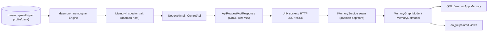

# Mnemosyne memory visualization spec

Status: design / spec. No production code yet. This document specifies how
`daemon-app` (Qt 6.11 QML/C++ GUI + Tui Widgets TUI) gains a **Mnemosyne memory
visualization** feature, and the `daemon` backend (`NodeApi` + `daemon-mnemosyne`)
extensions required to feed it. It is the single consolidated reference for the
feature and spans two repositories:

- `daemon-app` - the thin client (GUI + TUI) that renders the views.
- `daemon` - the orchestrator/agent runtime that owns memory and must expose it
  over `NodeApi`.

The original Python `mnemosyne-dashboard` (cloned under
`daemon-app/references/mnemosyne-dashboard/`) is the capability reference we port
from. `daemon-hermes` is research-only and is not a dependency. The original
Mnemosyne Python tree is **not** present locally; data-model facts below are taken
from the in-repo Rust port `daemon/crates/memory/daemon-mnemosyne/` (the
authoritative implementation) and its companion spec
`daemon/crates/engine/daemon-core/docs/mnemosyne-rust-port-spec.md`.

## Scope and non-goals

In scope:

- A complete **capability inventory** of the reference dashboard and a
  **GUI / TUI / GUI-only matrix** declaring what each front end supports.
- The **`daemon` NodeApi extension** for read-only memory inspection (DTOs, wire
  ops, the `MemoryInspector` seam, and the per-layer change checklist).
- The **`daemon-app` Memory feature module** (core seam + QML module + TUI parity)
  mirroring the existing `Files` feature end to end.
- A **graph visualization design**: Phase A is a 2D node-link graph (GUI-only);
  Phase B designs a 3D constellation view (Qt Quick 3D, GUI-only).
- A **graph library evaluation** (QuickQanava vs GraphFlow vs roll-our-own).

Out of scope (deferred, called out where relevant):

- Implementing the backend or frontend code. This document delivers the spec only.
- Memory **mutation** from the GUI (the dashboard's admin actions: invalidate,
  supersede, set trust/importance/expiry). Initial scope is **read-only**
  inspection; mutation is a later phase (section 8).
- Multi-bank live switching beyond the `ProfileRef` / `SessionId` scope model.
- The dashboard's 3D "Labyrinth" FPS walk-through and Neural Map. They are
  documented for completeness but are explicitly not targeted; Phase B targets only
  the constellation point-cloud.

## Reference material

- `daemon-app/references/mnemosyne-dashboard/` - the Python dashboard we port.
  Server: `server.py` (stdlib `ThreadingHTTPServer`); data layer:
  `dashboard_core.py` (`DashboardStore`); UI: `static/index.html`, `static/app.js`
  (~3.7k lines), `static/style.css`.
- `daemon/crates/memory/daemon-mnemosyne/` - the Rust port (BEAM SQLite engine).
  Schema: `src/store/schema.rs`; knowledge layers: `src/knowledge/*`.
- `daemon/crates/contracts/daemon-api/` - the `NodeApi` wire contract
  (`src/lib.rs`, `daemon-api.cddl`).
- Companion frontend precedent: the **Files** feature
  (`daemon-app/docs/file-browser-workspace-design.md`,
  `daemon-app/src/DaemonApp/Files/`, `daemon-app/src/core/fs/`).
- Candidate graph libraries: [QuickQanava](https://github.com/cneben/QuickQanava)
  (Qt6/QML node-link library), [GraphFlow](https://github.com/mohsenD98/GraphFlow)
  (early Qt/QML node editor).

## Architecture seam

Memory currently lives entirely **below** `NodeApi`, inside the engine: the
`daemon-core` `Engine` holds `Vec<Arc<dyn MemoryProvider>>`, and the Mnemosyne
provider persists to a per-(profile, session) SQLite bank. No `NodeApi` operation
can read memory contents today, and `daemon-app` has no wire client at all (every
backend seam is mocked). This feature adds a clean read path from the SQLite bank
up to the QML/TUI views.



Design rules carried from the existing seams:

- **One surface, many transports.** Clients marshal `ApiRequest`/`ApiResponse`
  as CBOR over the Unix socket (primary) or JSON over HTTP; in-process callers use
  the trait directly. The UI never sees the codec.
- **`daemon-host` stays decoupled from Mnemosyne.** `NodeApiImpl` depends on a new
  `MemoryInspector` trait, not on `daemon-mnemosyne` (the same injection pattern as
  `WorkspaceFs`, `CloudCatalog`, `AcpDiscovery`).
- **Read-only first.** All new ops are queries; mutation is a separate later phase.

## 1. Dashboard capability inventory

The reference dashboard is a single-page app with 13 primary nav tabs plus several
hidden routes, served by ~30 REST endpoints and one SSE stream. Everything is
backed by `DashboardStore` in `references/mnemosyne-dashboard/dashboard_core.py`,
reading a single `mnemosyne.db`. Capabilities below are grouped by the widget
primitive they require, because that primitive decides GUI/TUI support (section 2).

### 1.1 Views by tab

| Tab (route) | Key surfaces | Primary primitive |
| --- | --- | --- |
| **Overview** (`#overview`) | 6 stat cards; trust-mix / lifecycle / sources / scopes / top-sessions breakdowns; quick actions; **live memory stream** (SSE) | stat cards + horizontal bars + card grid |
| **Today** (`#today`) | 6 daily stat cards; top-entities/trust/lifecycle/sources/sessions breakdowns; Added / Recalled / Triples / Consolidations sub-grids | stat cards + bars + card grids |
| **Visualiser** (`#visualiser3d`) | Constellation / Neural Map modes; WebGL point cloud + links + labels; inspector; cluster pills; legend | **3D graph (WebGL)** |
| **Visualiser Legacy** (`#constellation`, hidden) | Same two modes on a 2D canvas with 3D projection math | **2.5D graph (canvas)** |
| **Mnemosyne Labyrinth** (`#memoryPalace`, hidden) | First-person 3D "memory palace"; rooms from context domains; memory relics; beacon search; inspector | **3D FPS graph** |
| **Review** (`#review`) | 4 trust-triage queues; search + min-importance slider; bulk action bar; review-reason badges | card grid + bulk toolbar |
| **Memories** (`#explore`) | Filter toolbar (kind/source/scope/session/veracity/tier/trust/status/sort); memory grid; recall-debug sub-tab (ranked list) | filterable card grid |
| **Context Bank** (`#profile`) | Pattern insights (content/temporal/sequence bars); context-domain bars; profile grid of sections | bars + section cards |
| **Lifecycle** (`#lifecycle`) | Threshold chips; hot/warm/cold/due stat cards; per-tier memory queues | chips + stat cards + lists |
| **Knowledge Graph** (`#graph`) | **Relationship graph** (SVG nodes + edges + predicate labels, pan/zoom); graph inspector; facts table (S-P-O-confidence) | **2D node-link graph** + table |
| **MEMORIA** (`#memoria`) | Overview cards + table counts; facts/timelines/instructions/preferences lists; KG table | stat cards + lists + table |
| **History** (`#activity`) | Timeline grouped by day or session (memory/triple/consolidation events); consolidation cards | timeline + card list |
| **Search** (hidden) | Global search across memories / facts / consolidations | card grids |
| **Settings** (`#settings`) | Auth; server/db; maintenance (admin mode, backup, audit log); diagnostics; runtime status; sync diagnostics | forms + tables |

Cross-cutting drawers/modals: memory detail drawer (trust strip, lifecycle,
effective weight, admin actions), session detail drawer (counts + mixed timeline),
JSON detail (triples/consolidations/search hits), and an admin confirm modal.

### 1.2 Endpoints consumed

Read (GET): `/api/health`, `/api/auth/status`, `/api/config`, `/api/diagnostics`,
`/api/runtime/status`, `/api/realtime/status`, `/api/realtime/events` (SSE),
`/api/stats`, `/api/digest/today`, `/api/review`, `/api/lifecycle`,
`/api/profile/inferred`, `/api/patterns`, `/api/constellation`, `/api/graph`,
`/api/search`, `/api/recall-debug`, `/api/timeline`, `/api/memories`,
`/api/memory`, `/api/session`, `/api/triples`, `/api/consolidations`,
`/api/memoria/{stats,facts,timelines,instructions,kg,preferences}`,
`/api/admin/audit`.

Write (POST, admin): `/api/auth/{login,logout}`, `/api/config`,
`/api/admin/backup`, `/api/admin/memory/{invalidate,importance,veracity,expiry,supersede}`.

Two distinct **graph payloads** drive every relationship/3D view:

- `/api/graph` - a **triples-only** subject-predicate-object graph
  (`dashboard_core.py` `graph()`): nodes are entities, edges carry
  `predicate`/`confidence`/validity.
- `/api/constellation` - triples **plus** top memories linked to regex-extracted
  entities via `"mentions"` edges; adds `clusters[]` for category grouping.

### 1.3 Real-time

The only live channel is **SSE** at `/api/realtime/events`: the server polls the DB
every ~2s and emits `memory` events typed `MEMORY_ADDED|UPDATED|RECALLED|
INVALIDATED|CONSOLIDATED|SNAPSHOT`, plus periodic `heartbeat`. There is **no**
WebSocket and no hook into Mnemosyne's write path - it is DB polling. Our backend
should reproduce this as a cursor-poll op with optional SSE on HTTP (section 4.5),
not assume an event bus exists.

## 2. GUI / TUI / GUI-only capability matrix

The TUI (Tui Widgets, custom-painted) can render any **text** primitive: lists,
cards, tables, timelines, key/value forms, and bars-as-text gauges. It cannot
render node-link or 3D scenes; for graph data it falls back to a navigable
list/tree of nodes and their edges. The GUI renders everything, and is the **only**
front end for the relationship graph and 3D views.

| Capability | GUI | TUI | Notes |
| --- | --- | --- | --- |
| Stat cards / counts | yes | yes | TUI: label + number rows |
| Breakdown bars (trust/lifecycle/sources/scopes/sessions/entities) | yes | yes (text gauges) | TUI renders `=====---` style bars |
| Memory card grid (Memories, Today, Search, Review) | yes | yes (list) | shared model; TUI is a `ZListView` |
| Memory detail drawer | yes | yes | TUI: key/value panel |
| Filter toolbar / sort | yes | yes | TUI: prompt/select chrome |
| Tables (Triples, MEMORIA KG, diagnostics) | yes | yes | TUI: aligned columns |
| Timeline / History (grouped events) | yes | yes | TUI: grouped list |
| Lifecycle queues + threshold chips | yes | yes | |
| Context Bank sections + pattern bars | yes | yes | bars-as-text |
| Recall-debug ranked list | yes | yes | |
| Settings / diagnostics / runtime status | yes | yes | TUI markdown projection |
| Live memory stream (SSE) | yes | yes | TUI appends to list on poll |
| **Knowledge / association node-link graph** | yes | **no (list fallback)** | **GUI-only**, Phase A |
| **3D constellation point cloud** | yes | no | **GUI-only**, Phase B |
| 3D Neural Map / FPS Labyrinth | (out of scope) | no | documented only |
| Memory mutation (invalidate/supersede/trust) | later phase | later phase | read-only first |

Rule of thumb: **if a capability needs a relationship graph or a 3D scene, it is
GUI-only.** Everything else reaches TUI parity by sharing the same C++ view-models,
exactly as `Files`/`Sidebar`/`Transcript` do today.

## 3. Mnemosyne data model

The Rust port (`daemon/crates/memory/daemon-mnemosyne/`) is a self-contained
SQLite "BEAM" engine. It does **not** use `daemon-store`; each memory bank is its
own `mnemosyne.db`. The full schema is in `src/store/schema.rs`. Only the subset a
visualization needs is summarized here.

### 3.1 Memory rows (nodes)

| Tier / table | Role | Notable fields |
| --- | --- | --- |
| `working_memory` | Hot / recent context | `id`, `content`, `source`, `timestamp`, `session_id`, `scope`, `importance`, `veracity`, `trust_tier`, `memory_type`, `recall_count`, `last_recalled`, `valid_until`, `superseded_by`, `author_id` |
| `episodic_memory` | Long-term | working fields + `tier` (1/2/3 degradation), `degraded_at`, `summary_of`, `binary_vector` (MIB blob) |
| `scratchpad` | Session notes | `id`, `content`, `session_id`, timestamps |

Derived attributes the dashboard computes and we should mirror in DTOs:
`memory_kind` (working|episodic), `degradation_tier`/`label` (hot/warm/cold),
`trust_weight`, `degradation_weight`, `effective_memory_weight`, `contaminated`
(veracity in inferred/tool/imported/unknown), and `status`
(active|expired|superseded, derived from `superseded_by` + `valid_until`).

Trust/veracity: `stated` (1.0), `inferred` (0.7), `tool` (0.5), `imported` (0.6),
`unknown` (0.8). Degradation tiers (episodic): T1 hot 1.0, T2 warm 0.5, T3 cold
0.25 (default thresholds 30 / 180 days).

The `Engine::MemoryRow` type (`src/engine.rs`) is the existing retrieval result and
the natural basis for our memory-node DTO:

```rust
pub struct MemoryRow {
    pub id: String, pub content: String, pub source: String,
    pub timestamp: String, pub importance: f64,
    pub veracity: String, pub trust_tier: String,
    pub tier: Tier, pub tier_level: i64, pub score: f64,
}
```

### 3.2 Graph layers (edges)

Mnemosyne has several overlapping graph layers. The visualization exposes them as
typed node/edge sets:

| Layer | Table | Node(s) | Edge meaning |
| --- | --- | --- | --- |
| **Memory adjacency** | `graph_edges` | memory <-> memory | `references` (co-mentioned entities, w=0.8), `related_to`, `ctx`, `rel`, `syn`; weighted |
| **Memory-entity** | `annotations` (`kind='mentions'`) | memory <-> entity (string) | `mentions` |
| **Knowledge (SPO)** | `consolidated_facts`, `facts` | entity <-> entity | `predicate` (with confidence, mention_count) |
| **Contradiction** | `conflicts` | fact <-> fact | `contradicts` |
| **Temporal world** | `triples` | entity <-> entity | versioned `predicate` (`valid_from`/`valid_until`) |
| **Episode** | `gists` | gist -> memory | `summarizes` (with participants) |
| **Identity** | `canonical_facts` | owner-scoped slots | version chain |

Existing traversal: `Engine::graph_query(id, depth)` does a BFS over `graph_edges`
returning `Related { memory_id, edge_type, weight, depth }`; `Engine::graph_link`
adds an edge. There is **no** bulk "dump all nodes/edges" API yet - section 4.6
adds export-style read methods.

Important caveats for the graph UI:

- **Entity nodes are un-normalized strings** (fuzzy-matched only at recall time).
  The graph payload must treat entity identity as the string value; we de-dup
  client/adapter-side.
- The `memoria_*` tables exist in the schema but are **not written** by the Rust
  port; treat MEMORIA views as backend-gated (section 8).
- `memory_events` (the sync event log) is schema-only; live updates use cursor
  polling, not this table.

### 3.3 Memory scope / addressing model

Memory is partitioned on three orthogonal axes (from `daemon-node` wiring and
`MnemosyneConfig`):

- **Profile (agent)** - disk-level bank: `<data_root>/<profile>/mnemosyne.db`. One
  `MnemosyneProvider` per `(ProfileRef, SessionId)`.
- **Session** - row-level: every row carries `session_id`; most reads filter
  `WHERE (session_id = ? OR scope = 'global')`.
- **Scope** - visibility: `session` (default) vs `global` (visible to all sessions
  on the bank).

The feature therefore addresses memory with an explicit scope descriptor rather
than guessing. Proposed wire shape:

```rust
pub struct MemoryScope {
    pub profile: ProfileRef,            // which agent's bank
    pub session: Option<SessionId>,     // None = whole bank; Some = session-scoped
    pub include_global: bool,           // fold in scope='global' rows (default true)
}
```

`ProfileRef` and `SessionId` are the existing `daemon-common` newtypes, so this
reuses the addressing the rest of `NodeApi` already uses (`ProfileGet`,
`SessionsQuery { scope: ByProfile(..) }`, etc.).

## 4. Backend: daemon NodeApi extension

This is the work that lands in the `daemon` repo. It follows the established
read-query playbook used by `fs_*` and `ProfileHistory`: structured DTOs, request/
response enum variants, a `dispatch` arm, a defaulted `ControlApi` method, and a
`NodeApiImpl` handler that delegates to an injected subsystem trait. Streaming uses
the cursor-poll + optional push-stream split used by `FsWatchPoll`/`subscribe`.

### 4.1 Where the ops live

Memory inspection is operator/GUI read state, so the methods go on **`ControlApi`**
(alongside `fs_*`, `checkpoints`, `stats`) rather than a new sub-trait. Adding a new
sub-trait would force an update to the `NodeApi` blanket-impl bound

```rust
pub trait NodeApi:
    SessionApi + ControlApi + ModelApi + ProfileApi + CredentialApi + AuthApi {}
```

which is heavier than needed. All methods get a default `Err(ApiError::Unsupported(..))`
body so partial implementors (e.g. session-only FFI) still compile.

### 4.2 DTOs

Define in a new `daemon-api/src/memory.rs` re-exported from `lib.rs` (mirrors how
`profile.rs` is organized):

```rust
pub struct MemoryScope { pub profile: ProfileRef, pub session: Option<SessionId>, pub include_global: bool }

pub enum MemoryTier { Working, Episodic, Scratchpad }

pub struct MemoryEntry {
    pub id: String,
    pub content: String,
    pub source: String,
    pub timestamp: String,        // RFC3339
    pub session_id: Option<String>,
    pub scope: String,            // "session" | "global"
    pub tier: MemoryTier,
    pub tier_level: i64,          // episodic 1/2/3; else 1
    pub importance: f64,
    pub veracity: String,
    pub trust_tier: String,
    pub recall_count: i64,
    pub last_recalled: Option<String>,
    pub valid_until: Option<String>,
    pub superseded_by: Option<String>,
    pub status: MemoryStatus,     // Active | Expired | Superseded
    pub degradation: Option<Degradation>, // tier label + weights (episodic)
    pub effective_weight: f64,
    pub score: Option<f64>,       // set for search/recall results
}

pub struct MemoryStats {
    pub working: u64, pub episodic: u64, pub scratchpad: u64,
    pub triples: u64, pub facts: u64, pub conflicts: u64,
    pub by_source: Vec<Bucket>, pub by_scope: Vec<Bucket>,
    pub by_veracity: Vec<Bucket>, pub by_degradation: Vec<Bucket>,
    pub by_session: Vec<Bucket>,
}
pub struct Bucket { pub key: String, pub count: u64 }

pub enum MemoryGraphKind { Association, Knowledge, Constellation }

pub struct MemoryNode {
    pub id: String,
    pub kind: MemoryNodeKind,     // Memory | Entity | Fact | Gist | Conflict
    pub label: String,
    pub weight: f64,              // importance / confidence / mention_count
    pub meta: BTreeMap<String, String>,
}
pub struct MemoryEdge {
    pub source: String, pub target: String,
    pub edge_type: String,        // references | mentions | <predicate> | contradicts | summarizes
    pub weight: f64,
    pub label: Option<String>,    // predicate text for SPO edges
}
pub struct MemoryGraph { pub kind: MemoryGraphKind, pub nodes: Vec<MemoryNode>, pub edges: Vec<MemoryEdge>, pub clusters: Vec<MemoryCluster> }
pub struct MemoryCluster { pub id: String, pub label: String, pub node_ids: Vec<String> }

pub struct MemoryListQuery {
    pub scope: MemoryScope,
    pub tier: Option<MemoryTier>,
    pub source: Option<String>,
    pub veracity: Option<String>,
    pub status: Option<MemoryStatus>,
    pub text: Option<String>,     // substring/FTS filter
    pub sort: MemorySort,         // Recent | Importance | RecallCount
    pub after: Option<String>,    // opaque cursor
    pub limit: u32,
}
pub struct MemoryPage { pub items: Vec<MemoryEntry>, pub next_cursor: Option<String> }

pub struct MemoryTimeline { pub groups: Vec<MemoryTimelineGroup> }
pub struct MemoryTimelineGroup { pub key: String, pub events: Vec<MemoryEvent> }
pub struct MemoryEvent { pub seq: u64, pub kind: MemoryEventKind, pub memory_id: Option<String>, pub at: String, pub summary: String }
pub enum MemoryEventKind { Added, Updated, Recalled, Invalidated, Consolidated, Snapshot }
```

### 4.3 ControlApi methods

```rust
async fn memory_stats(&self, scope: MemoryScope) -> Result<MemoryStats, ApiError> { Err(ApiError::Unsupported("memory_stats".into())) }
async fn memory_list(&self, query: MemoryListQuery) -> Result<MemoryPage, ApiError> { ... }
async fn memory_get(&self, scope: MemoryScope, id: String) -> Result<Option<MemoryEntry>, ApiError> { ... }
async fn memory_graph(&self, scope: MemoryScope, kind: MemoryGraphKind, seed: Option<String>, depth: u32, limit: u32) -> Result<MemoryGraph, ApiError> { ... }
async fn memory_search(&self, scope: MemoryScope, text: String, limit: u32) -> Result<MemoryPage, ApiError> { ... }
async fn memory_timeline(&self, scope: MemoryScope, group: TimelineGroup, limit: u32) -> Result<MemoryTimeline, ApiError> { ... }
// live updates, cursor-poll form (every transport); push stream for HTTP/in-process
async fn memory_watch_poll(&self, scope: MemoryScope, after_seq: u64, max: u32) -> Result<MemoryWatchPage, ApiError> { ... }
fn memory_watch(&self, _scope: MemoryScope) -> MemoryEventStream { /* default: empty */ }
```

### 4.4 Wire variants and dispatch

In `daemon-api/src/lib.rs`, add matching arms to `ApiRequest` / `ApiResponse`:

```rust
// ApiRequest
MemoryStats { scope: MemoryScope },
MemoryList { query: MemoryListQuery },
MemoryGet { scope: MemoryScope, id: String },
MemoryGraph { scope: MemoryScope, kind: MemoryGraphKind, seed: Option<String>, depth: u32, limit: u32 },
MemorySearch { scope: MemoryScope, text: String, limit: u32 },
MemoryTimeline { scope: MemoryScope, group: TimelineGroup, limit: u32 },
MemoryWatchPoll { scope: MemoryScope, after_seq: u64, max: u32 },

// ApiResponse
MemoryStats(MemoryStats),
MemoryPage(MemoryPage),
MemoryEntry(Option<MemoryEntry>),
MemoryGraph(MemoryGraph),
MemoryTimeline(MemoryTimeline),
MemoryWatch(MemoryWatchPage),
```

And the `dispatch()` arms (mirroring the existing `FsList` arm):

```rust
ApiRequest::MemoryGraph { scope, kind, seed, depth, limit } =>
    match api.memory_graph(scope, kind, seed, depth, limit).await {
        Ok(g) => ApiResponse::MemoryGraph(g),
        Err(e) => ApiResponse::Error(e),
    },
```

### 4.5 Streaming

The push stream (`memory_watch`) is a transport capability, not a wire variant
(same as `subscribe` vs the `Subscribe` cursor variant). HTTP exposes it as SSE
(`GET /memory/watch`), reusing the dashboard's event taxonomy. Plain CBOR clients
long-poll `MemoryWatchPoll { after_seq, max }`. The backend can satisfy this by
diffing the bank (the dashboard's own approach) or, later, by tailing
`memory_events` once the Rust port writes it.

### 4.6 Subsystem seam: `MemoryInspector` + Mnemosyne read methods

To keep `daemon-host` decoupled from `daemon-mnemosyne`, add a trait in
`daemon-host` (next to the `WorkspaceFs`/`CloudCatalog` injection points):

```rust
#[async_trait]
pub trait MemoryInspector: Send + Sync {
    async fn stats(&self, scope: &MemoryScope) -> anyhow::Result<MemoryStats>;
    async fn list(&self, query: &MemoryListQuery) -> anyhow::Result<MemoryPage>;
    async fn get(&self, scope: &MemoryScope, id: &str) -> anyhow::Result<Option<MemoryEntry>>;
    async fn graph(&self, scope: &MemoryScope, kind: MemoryGraphKind, seed: Option<&str>, depth: u32, limit: u32) -> anyhow::Result<MemoryGraph>;
    async fn search(&self, scope: &MemoryScope, text: &str, limit: u32) -> anyhow::Result<MemoryPage>;
    async fn timeline(&self, scope: &MemoryScope, group: TimelineGroup, limit: u32) -> anyhow::Result<MemoryTimeline>;
    async fn watch_poll(&self, scope: &MemoryScope, after_seq: u64, max: u32) -> anyhow::Result<MemoryWatchPage>;
}
```

`NodeApiImpl` holds `memory: Option<Arc<dyn MemoryInspector>>` with a
`with_memory_inspector(..)` builder (mirroring `with_workspace`), and each
`ControlApi::memory_*` method returns `Unsupported` when it is `None`.

The concrete `MemoryInspector` impl lives next to the Mnemosyne bank cache and
needs **new read methods on `Engine`**, because the current API has no bulk
list/edge dump. Minimal additions to `daemon-mnemosyne`:

- `Engine::list_memories(filter, sort, after, limit)` - paged scan over
  `working_memory` + `episodic_memory` honoring scope/session/global.
- `Engine::graph_dump(kind, seed, depth, limit)` - returns nodes+edges for one of
  the three kinds by reading `graph_edges` / `annotations` / `consolidated_facts`
  (+ `triples`), de-duplicating entity strings into nodes.
- `Engine::stats()` already exists (counts); extend with the by-* buckets.
- `Engine::recent_events(after_seq, max)` - for `watch_poll`; until `memory_events`
  is written, derive from `created_at`/`last_recalled`/`consolidation_log` deltas
  (the dashboard's polling approach).

These are read-only and reuse existing SQL patterns in `src/store/`.

### 4.7 Per-layer change checklist (daemon)

| Layer | File | Change |
| --- | --- | --- |
| DTOs | `daemon-api/src/memory.rs` (new), re-export in `src/lib.rs` | the structs in 4.2 |
| Trait | `daemon-api/src/lib.rs` (`ControlApi`) | methods in 4.3 (defaulted) |
| Wire enums | `daemon-api/src/lib.rs` (`ApiRequest`/`ApiResponse`) | variants in 4.4 |
| Dispatch | `daemon-api/src/lib.rs` (`dispatch`) | arms in 4.4 |
| Wire contract | `daemon-api/daemon-api.cddl` | add DTO + request/response shapes |
| Wire version | `daemon-common/src/lib.rs` | bump `WireVersion::CURRENT` 15 -> 16 |
| Handler + seam | `daemon-host/src/node_api.rs` | `MemoryInspector` field + `with_memory_inspector` + `impl ControlApi` arms |
| Inspector impl | `daemon-mnemosyne` (or `daemon-host/src/memory.rs` adapter) | implement `MemoryInspector` over bank cache |
| Engine reads | `daemon-mnemosyne/src/engine.rs` + `src/store/` | `list_memories`, `graph_dump`, extended `stats`, `recent_events` |
| Wiring | `daemon-node/src/lib.rs` (`assemble`) | `node_api.with_memory_inspector(..)` from the same cache as `memory_builder` |
| Tests | `daemon-api` cbor round-trips; `tests/daemon-conformance` | socket round-trip for each op |

Wire-version note: these are additive variants, so `#[serde(default)]` on new
optional fields avoids breaking older peers, but bumping `CURRENT` to 16 documents
the new surface and lets the client gate on capability.

## 5. Frontend: daemon-app Memory feature module

The app is a C++20 / Qt 6.11 thin client with **two binaries** (the QML GUI
`daemon-app` and the Tui Widgets TUI `daemon-tui`) sharing a toolkit-agnostic
`src/core/` layer and most view-models under `src/DaemonApp/`. The backend is **not
wired yet** - every seam is a mock behind an interface. The Memory feature is built
the same way the **Files** feature is, so the entire surface can be developed
against a mock and switched to the real `NodeApi` adapter in one place.

### 5.1 Core seam (no QML)

```
daemon-app/src/core/memory/
  imemory_service.h        // async, signal-based query API (mirrors IFsService)
  memory_dtos.h            // MemoryEntry/Node/Edge/Graph/Stats/Timeline structs + Q_DECLARE_METATYPE
  mock_memory_service.cpp  // seeded demo bank (memories + entities + a small graph)
  CMakeLists.txt           // target daemon-app::memory
```

`IMemoryService` mirrors `IConnectionService`/`IFsService`: request methods plus
result signals, so the UI never blocks and never sees the codec. Sketch:

```cpp
class IMemoryService : public QObject {
    Q_OBJECT
public:
    virtual void requestStats(const MemoryScope&) = 0;
    virtual void requestList(const MemoryListQuery&) = 0;
    virtual void requestGraph(const MemoryScope&, MemoryGraphKind, QString seed, int depth, int limit) = 0;
    virtual void requestSearch(const MemoryScope&, QString text, int limit) = 0;
    virtual void requestTimeline(const MemoryScope&, TimelineGroup, int limit) = 0;
    virtual void startWatch(const MemoryScope&) = 0;   // emits memoryEvent on poll
    virtual void stopWatch() = 0;
signals:
    void statsReady(const MemoryStats&);
    void pageReady(const MemoryPage&);          // list/search
    void graphReady(const MemoryGraph&);
    void timelineReady(const MemoryTimeline&);
    void memoryEvent(const MemoryEvent&);       // live stream
    void failed(QString op, QString message);
};
```

The DTOs in `memory_dtos.h` are the C++ mirror of the `daemon-api` DTOs in section
4.2. The real adapter (later) decodes `ApiResponse::Memory*` into these structs;
`MockMemoryService` fills them from an in-memory seeded bank for UI development.

`Application::registerContext()` constructs the service and exposes it as the
`Memory` context property (next to `Fs`, `Connection`, `DaemonConfig`):

```cpp
engine.rootContext()->setContextProperty(QStringLiteral("Memory"), m_memory);
```

### 5.2 QML module and view-models

```
daemon-app/src/DaemonApp/Memory/
  CMakeLists.txt              // qt_add_qml_module(da_memory URI DaemonApp.Memory)
  memory_list_model.h/.cpp    // QML_ELEMENT QAbstractListModel (memory cards/rows)
  memory_graph_model.h/.cpp   // QML_ELEMENT graph snapshot (nodes/edges) for the graph view
  memory_stats_model.h/.cpp   // QML_ELEMENT buckets for breakdown bars
  memory_timeline_model.h/.cpp
  qml/
    MemoryPage.qml            // manager-page host: sub-tabs (Overview/Memories/Graph/Timeline)
    MemoryOverview.qml        // stat cards + breakdown bars (shared primitive with TUI)
    MemoryList.qml            // filterable ListView of MemoryListModel (clone of FileTree pattern)
    MemoryDetail.qml          // detail drawer (trust strip, lifecycle, weights)
    MemoryGraphView.qml       // GUI-only node-link graph (section 6)
    MemoryTimeline.qml        // grouped event list
```

The models bind to the `Memory` context property exactly as `FsExplorerModel`
binds to `Fs`:

```qml
MemoryListModel { id: memModel; service: Memory }
```

Each model is a `QML_ELEMENT` `QAbstractListModel` with custom roles + `roleNames()`
and `Q_INVOKABLE` actions (filter, select, refresh) - the same bridge pattern used
across the app. Register the module in `src/DaemonApp/CMakeLists.txt`
(`add_subdirectory(Memory)`), link `daemon-app::memory` in `App/CMakeLists.txt`, and
import the plugin in `App/main.cpp`:

```cpp
Q_IMPORT_QML_PLUGIN(DaemonApp_MemoryPlugin)
```

### 5.3 Navigation

Register Memory as a **singleton manager page** (the same mechanism as Settings /
Models / Fleet):

- Add a `TabModel::Kind::Memory` enum value (`src/DaemonApp/Tabs/tab_model.h`).
- Add a `Loader` case in `Conversation.qml` that loads `MemoryPage.qml` for that
  kind.
- Add a command-palette entry / `Nav.open("memory")` route in `Main.qml`.

A per-agent entry point (open the memory of the profile bound to the active
session) is the primary affordance; a node-wide picker (choose
`ProfileRef`/`SessionId`) lives in `MemoryPage.qml`'s header, driving the
`MemoryScope` passed to every request.

### 5.4 TUI parity

Add the text-capable models to `da_tui_viewmodels` in `src/tui/CMakeLists.txt`
(`MemoryListModel`, `MemoryStatsModel`, `MemoryTimelineModel`) and link
`daemon-app::memory`. New painted views under `src/tui/`:

- `memory_list_view.cpp` - clone of `file_tree_view.cpp` over `MemoryListModel`.
- `memory_overview_view.cpp` - stat rows + text-gauge bars (`=====---`) over
  `MemoryStatsModel`.
- `memory_timeline_view.cpp` - grouped list.

The **graph** is GUI-only; the TUI's "graph" tab degrades to a node list where
selecting a node lists its edges/neighbors (a navigable adjacency view over the
same `MemoryGraph` payload). `DisplayPresenter` (`src/core/presentation/`) gains
memory node-type -> icon/tone mappings shared by both front ends.

### 5.5 Connecting to the backend later

When the `NodeApi` client lands (the `IConnectionService` local/remote adapter
documented in `docs/first-run-config-audit.md`), the only new code is a
`DaemonMemoryService : IMemoryService` that issues the section-4 `ApiRequest`
variants over the connection and decodes `ApiResponse::Memory*` into the DTOs.
`Application` swaps `MockMemoryService` for it; no QML, model, or TUI code changes.

## 6. Graph visualization design

The relationship/3D views are the GUI-only heart of the feature. The constraint is
hard: **QML / Qt Quick in C++ only** (the app targets mobile + hardware rendering;
no Qt Widgets for content). Both phases consume the same `MemoryGraph` payload
(section 4.2) so the data path is identical.

### 6.1 Graph data model in the client

`MemoryGraphModel` holds the current `MemoryGraph` snapshot and exposes:

- typed nodes (`Memory`, `Entity`, `Fact`, `Gist`, `Conflict`) with `label`,
  `weight`, and a meta map for the inspector;
- typed edges (`references`, `mentions`, `<predicate>`, `contradicts`,
  `summarizes`) with weight and optional label;
- the `MemoryGraphKind` selector (Association / Knowledge / Constellation) that
  re-requests the graph;
- a seed + depth control (BFS expansion from a focused memory, backed by
  `memory_graph`'s `seed`/`depth`).

Layout is computed client-side. Two layout strategies, selected per kind:

- **Force-directed** (Fruchterman-Reingold / Barnes-Hut) for association and
  knowledge graphs - organic clustering of related memories/entities.
- **Layered / radial** for seeded BFS expansion (focus node at center, neighbors by
  depth ring) - reuses the layering ideas already in the BlockEditor diagram
  pipeline.

### 6.2 Phase A - 2D node-link graph (GUI-only)

Render with the in-repo **Qt Quick Scene Graph** pipeline that BlockEditor already
uses for Mermaid: `DiagramController` builds a `RenderSnapshot`, and `DiagramItem`
(a `QQuickItem` overriding `updatePaintNode`,
`src/DaemonApp/BlockEditor/app/diagram_item.h`) draws batched `QSGGeometryNode`s for
edges and `QSGTextNode`s for labels, rebuilding geometry only on snapshot revision
change while pan/zoom/hover touch only the camera transform. This is exactly the
machinery a memory graph needs and it is already proven on-device.

The plan is a sibling `MemoryGraphItem` (or a generalization of `DiagramItem`) that:

- takes the `MemoryGraph` snapshot + computed layout as its IR (instead of the
  Mermaid `DiagramModel`);
- renders nodes as styled circles/rounded rects colored by node kind and sized by
  weight, edges as lines/curves styled by edge type, with predicate labels on SPO
  edges;
- supports pan, zoom, hover highlight, node selection (-> `MemoryDetail` drawer),
  and double-click to expand (`seed`+`depth` re-request);
- supports cluster tints from `MemoryGraph.clusters` (the constellation category
  grouping).

`MemoryGraphView.qml` hosts the item plus an inspector panel and the
kind/seed/depth controls. This is the default graph experience and ships first.

### 6.3 Phase B - 3D constellation (GUI-only, designed not built first)

A **Qt Quick 3D** scene consuming the same payload with the `Constellation` kind
(triples + memory->entity `mentions`). Design:

- node positions on a spherical shell grouped by `MemoryGraph.clusters`
  (categories), memories vs entities distinguished by mesh/color;
- edges as line segments / thin cylinders; labels as billboarded `Node` overlays
  for the focused/nearby subset only (label budget for perf);
- orbit camera (pan/zoom/rotate), node pick -> inspector, the same seed/expand model
  as 2D.

Phase B explicitly builds on Phase A's data model and inspector; only the renderer
differs. The dashboard's Neural Map and FPS "Labyrinth" remain out of scope.

### 6.4 TUI fallback

No node-link or 3D rendering. The TUI graph tab is a navigable adjacency list over
the same `MemoryGraph`: a node list, and selecting a node shows its edges and
neighbor nodes (drill in/out). This keeps graph **data** reachable in the terminal
without a renderer.

## 7. Graph library evaluation

Constraint: QML / Qt Quick in C++ only; must run on the same hardware-rendered,
mobile-capable shell; must accept our `MemoryGraph` IR; ideally reuses our existing
Scene Graph approach. Candidates:

| Criterion | QuickQanava | GraphFlow | Roll our own (DiagramItem) |
| --- | --- | --- | --- |
| Purpose | C++17 Qt6/QML node/graph visualization library | Early node-based graph **editor** app | In-repo Qt Quick Scene Graph diagram renderer |
| Maturity | ~1.4k stars, 1.4k+ commits, releases through 2024 | ~6 stars, 17 commits, "early version" | Already shipping (Mermaid in transcripts) |
| Qt6 / QML-native | yes (min Qt 6.5, rec 6.6) | yes (Qt 6.4+) | yes (Qt 6.11, `QQuickItem`/`updatePaintNode`) |
| License | BSD-3-Clause (permissive) | unspecified / none stated | n/a (our code) |
| Rendering | QML delegates per node/edge | QML items | batched `QSGGeometryNode` + `QSGTextNode` |
| Large-graph perf | good for medium graphs; per-node QML items add cost at scale | unknown / untuned | strong - geometry batched, pan/zoom = transform only |
| Custom node/edge styling | strong (author delegates in QML) | limited | full control, but we write it |
| Fit to our IR | adapter needed (its own graph model) | adapter needed | native - our IR is the input |
| Integration cost | add submodule/dep, learn model, bridge data | not viable (it's an app, not a lib) | extend existing, proven code |
| Maintenance risk | external dep, but active + permissive | abandoned-risk, immature | ours to maintain |

Assessment:

- **GraphFlow** is an early application, not a reusable library, with no stated
  license. Use as a UX reference only; do not depend on it.
- **QuickQanava** is the strongest off-the-shelf option: mature, permissively
  licensed, Qt6/QML-native, with first-class node/edge delegate authoring and
  built-in connectors/groups/selection. Its cost is a new dependency, an extra
  graph model to bridge to our IR, and per-node QML item overhead on very large
  graphs.
- **Roll our own** on `DiagramItem` reuses code that already renders fast on-device,
  takes our IR directly, needs no new dependency, and matches the Scene Graph
  approach the rest of the app uses. Its cost is implementing layout + interaction
  ourselves (force-directed layout, hit-testing - though hit-testing/pan/zoom
  already exist in `DiagramItem`).

Recommendation: **prototype Phase A on our own `DiagramItem` pipeline.** It is the
lowest-dependency, best-performing path and reuses proven code. Keep
**QuickQanava** as the documented fallback if interactive graph **editing**,
ports/docks, or very large graphs outgrow the in-house renderer faster than we want
to build them.

Decision gate - a short spike before committing:

1. Build a throwaway `MemoryGraphItem` from `DiagramItem` rendering ~500-1000
   seeded nodes/edges with force-directed layout; measure frame time on the target
   device and assess interaction (pan/zoom/select/expand).
2. In parallel, stand up a minimal QuickQanava scene with the same data to compare
   styling effort and perf.
3. Choose based on the spike; record the decision in this section. Default to
   roll-our-own unless the spike shows a clear QuickQanava advantage.

### 7.1 Decision (recorded)

**Roll our own** - no new dependency. Phase A is implemented as a QtQuick render
(`MemoryGraphView.qml`: `Canvas` for edges + `Repeater` for nodes) driven by a
force-directed layout computed in C++ (`MemoryGraphModel::layout()`, a compact
Fruchterman-Reingold producing normalized `[0,1]` positions). This keeps the graph
**data + layout** in the shared model (so the TUI adjacency view and the GUI render
agree), satisfies the QML/QtQuick-in-C++ constraint, and avoids a third-party
dependency. Pan/zoom/select/expand live in the QML view (`DragHandler` +
`WheelHandler` + `TapHandler`).

The heavier `DiagramItem` `QSGGeometryNode`/`QSGTextNode` path remains the
documented **performance upgrade**: at large node counts (~1k+), swap
`MemoryGraphView`'s `Canvas`/`Repeater` for a `MemoryGraphItem` (`QQuickItem` +
`updatePaintNode`) consuming the same `MemoryGraphModel` layout, with no change to
the seam, models, or TUI. QuickQanava stays the fallback only if interactive graph
*editing* (ports/docks) becomes a requirement. The on-device frame-time spike at 1k
nodes is the trigger for that swap; until then the Canvas render is sufficient for
the realistic per-scope graph sizes (tens of nodes).

## 8. Phased roadmap

Backend (B) and frontend (F) milestones, ordered by dependency. The frontend can
start immediately against the mock; the real adapter waits on B1-B2 and the
`IConnectionService` NodeApi client.

| # | Milestone | Repo | Depends on |
| --- | --- | --- | --- |
| F0 | `core/memory` seam + DTOs + `MockMemoryService` (seeded bank) | daemon-app | - |
| F1 | `DaemonApp.Memory` module: Overview (cards+bars), Memories (list+detail), Timeline; manager-page nav | daemon-app | F0 |
| F2 | TUI parity for F1 (list/overview/timeline views + adjacency fallback) | daemon-app | F0, F1 |
| S1 | Graph renderer spike (DiagramItem vs QuickQanava); record decision (section 7) | daemon-app | F0 |
| F3 | Phase A 2D node-link graph view (`MemoryGraphItem` + layout + inspector + expand) | daemon-app | S1 |
| B1 | `daemon-api` DTOs + `ControlApi` methods + wire variants + dispatch + CDDL + wire-version bump | daemon | - |
| B2 | `MemoryInspector` seam in `daemon-host` + Mnemosyne read methods (`list_memories`, `graph_dump`, extended `stats`) + `assemble` wiring | daemon | B1 |
| B3 | `memory_watch_poll` + HTTP SSE; live stream | daemon | B2 |
| F4 | `DaemonMemoryService : IMemoryService` real adapter; swap mock | daemon-app | B1, B2, NodeApi client |
| F5 | Live stream wiring (`startWatch` -> SSE/poll), Review + Lifecycle + Context Bank views | both | B3, F4 |
| F6 | Phase B 3D constellation (Qt Quick 3D) | daemon-app | F3, F4 |
| Later | Memory mutation ops (invalidate/supersede/trust/importance/expiry) + admin gating; MEMORIA views once the Rust port writes `memoria_*` | both | F4 |

Critical path to a usable feature: F0 -> F1 -> (B1, B2) -> F4 gives full read-only
inspection (lists, cards, timeline) wired to real memory; F3 adds the graph; F5/F6
add live updates and 3D.

## 9. Out of scope / future

- **Mutation from the UI** - the dashboard's admin actions (invalidate, supersede,
  set trust/importance/expiry, backup) are deferred. They map to new write ops on
  `ControlApi` and a permission/confirm flow; specify separately when scheduled.
- **MEMORIA views** (`memoria_facts/timelines/instructions/preferences/kg`) - the
  schema exists but the Rust port does not populate it; gate these views on backend
  work.
- **Neural Map and FPS "Labyrinth"** - documented in section 1 for completeness;
  not targeted. Phase B covers only the constellation point cloud.
- **Recall-debug / pattern detection** - the dashboard approximates these in Python;
  in our stack they should be backed by real `daemon-mnemosyne` diagnostics
  (`Engine::diagnose`, recall scoring) rather than reimplemented heuristics.
- **Multi-bank federation / live bank switching** beyond the `MemoryScope`
  (profile + session + global) model.

## 10. Source index

| Area | Authoritative path |
| --- | --- |
| Dashboard server / data / UI | `daemon-app/references/mnemosyne-dashboard/{server.py,dashboard_core.py,static/}` |
| Mnemosyne schema | `daemon/crates/memory/daemon-mnemosyne/src/store/schema.rs` |
| Mnemosyne engine / knowledge | `daemon/crates/memory/daemon-mnemosyne/src/{engine.rs,knowledge/}` |
| NodeApi contract | `daemon/crates/contracts/daemon-api/{src/lib.rs,daemon-api.cddl}` |
| Wire version | `daemon/crates/contracts/daemon-common/src/lib.rs` |
| NodeApi impl | `daemon/crates/substrate/daemon-host/src/node_api.rs` |
| Node assembly | `daemon/crates/node/daemon-node/src/lib.rs` |
| Files feature (frontend precedent) | `daemon-app/src/DaemonApp/Files/`, `daemon-app/src/core/fs/` |
| Diagram renderer (graph precedent) | `daemon-app/src/DaemonApp/BlockEditor/app/diagram_item.h` |
| App context wiring | `daemon-app/src/DaemonApp/App/{application.cpp,main.cpp}` |
| TUI sharing | `daemon-app/src/tui/CMakeLists.txt`, `daemon-app/src/tui/file_tree_view.cpp` |
