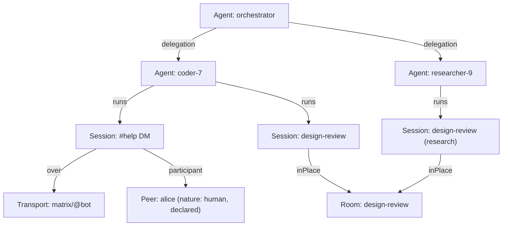
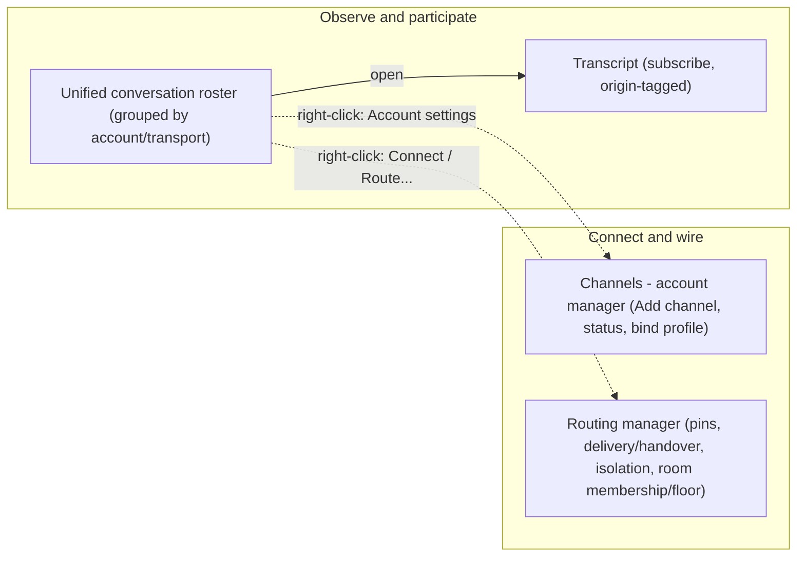

# Multi-protocol client surface (daemon-app)

Status: design proposal. The **core seams** land inert (`core/transports/`:
`ITransportRegistry` + `IPresenceService` + mocks, registered as the `Transports` / `Presence` QML
context properties); the QML surfaces (Channels manager, unified roster, capability-gated
affordances, origin-attributed transcript) are documented here as follow-up, not built yet.

Companion to the daemon-node spec
`daemon-node/crates/engine/daemon-core/docs/daemon-transport-adapter-spec.md` (the adapter framework
this client renders) and the user stories `04-channels-and-events-io.md`, `05-routing-manager.md`,
`06-rooms-multi-agent.md`.

---

## 0. The model: a multi-protocol messenger

Three mature multi-protocol messengers — Pidgin/libpurple, Kopete (KDE/Qt, closest to our Qt stack),
and Adium (a native client over libpurple, structurally our "Qt client over daemon-node") —
converge on one information architecture. daemon-app should adopt it directly, because the daemon
already exposes the matching primitives (`Origin`, sessions, `DeliveryTarget`/`Primary`/`Spectator`,
`subscribe`, the routing registry, and the new transport-adapter framework).

The headline reframing: **an internal Room is not a special case — it is one transport among many**
("a transport whose participants are agents"); a Matrix room is the same shape with humans. So the
client is a *transport-agnostic* messenger, not a Rooms-specific UI.

| Messenger concept | Adium / Kopete / libpurple | daemon-app surface | Backed by |
| --- | --- | --- | --- |
| Account | `AIAccount` / `Kopete::Account` / `PurpleAccount` | a connected channel | `transport_instances` + `bound_accounts` |
| Account manager | account prefs + service picker | **Channels** surface | `ITransportRegistry.availableAdapters` + AuthApi |
| Buddy list / roster | unified source list | **unified conversation roster** | `SessionsQuery` (ByTransport/ByProfile) |
| Conversation window | chat window / tabs | **Transcript** (tabbed) | `subscribe` merged log |
| Chat room / channel | MUC / chat | `OriginScope::Group` session (Matrix room OR internal Room) | sessions + `daemon-rooms` |
| Account status dot | online/offline icon | **status bar + roster presence** | `IPresenceService` / `transport_instances` |
| Service-specific actions | capability-gated UI | **capability-gated affordances** | `AdapterCapabilities` |
| Person / MetaContact | `AIMetaContact` / `MetaContact` / `PurplePerson` | (deferred, §7) | — |

---

## 1. The unifying model: the DaemonNet

The messenger model (§0) reconciles *transport*, but on its own it does not reconcile the daemon's
**fleet/supervision hierarchy** (nodes → agents → sessions) — multi-protocol messengers have no agent
org chart, because they have no agents. The reconciliation is **not** "fleet vs transport as two
separate trees". It is **one canonical model with several projections**: the **DaemonNet**.

(Term: the unified structure is the **DaemonNet** — the daemon's network of actors and places joined by
conversation/delegation/membership edges. Conversations are only one edge kind, so it is not a
"conversation graph"; "graph" below is used only in the generic node-edge/visual sense.)

### 1.1 The model: typed nodes + edges (sessions are nodes)

Model the daemon as the **DaemonNet** — a network of typed nodes joined by typed edges:

- **Actor nodes:** `Agent` (a daemon-managed agent we run), `Peer` (an external party reached over a
  transport whose nature — human / bot / foreign-agent — we **cannot verify**; carries a *declared,
  unverified* `nature` hint, for display only — never asserted as truth), and `User` (a human
  operator/principal of the daemon; see §1.6).
- **Place nodes:** `Room` and `Channel` — the shared spaces conversations happen in.
- **`Session` is a first-class node**, not an edge: a conversation has its own id/transcript/lifecycle,
  and reifying it as a node is what makes solo sessions (no peer), multi-party rooms (a hyperedge), and
  the `SessionId` join key all work.
- **Edges:** `Runs` (Agent → Session), `Over` (Session → Transport), `Participant`
  (Session → Peer/Agent/User, role author|primary|spectator), `InPlace` (Session → Room/Channel), and
  `Delegation` (Agent → Agent). The **agent-has-many-sessions 1:many** (§1.2) *is* the `Runs` edges
  (one Agent node, N `Runs` → its Session nodes); the **fleet/supervision hierarchy is the
  `Delegation` subgraph**, drawn as a spanning tree; agent↔room membership is *derived* (an agent runs
  a session that is `InPlace` the room).

(`coder-7` has two `runs` edges — the 1:many. The Admin who renders this view is implicit, not a node;
§1.6.)

So **transport and fleet stop being two separate structures** — they are two *facets of the same
Session node*: each session has a **provenance** (its `Runs` agent → the Fleet projection), a
**transport** (its `Over` → the Channels projection), and **participants** (its `Participant` peers →
a future By-Peer projection). One node, three index keys. "Org chart" and "network topology" (two
descriptions of the fleet tree) are the *same DaemonNet* rendered hierarchy-first vs node-first.

> **Wire vs client-derived.** The NodeApi wire exposes sessions / units / transports — *not* chat-app
> contacts. `Peer`, `User`, `Channel`, and the **By-Peer** projection have **no wire equivalent**: they
> are **client-derived** by the DaemonNet from each session's `Origin` / `DeliveryTarget` / participant
> edges. The typed `IDaemonNet` read seam (`unitChildren`/`unit`/`tags`/`sessionsInScope`/
> `sessionDetail`/`content`, roadmap P2) returns wire-shaped data; the `channels()`/`byPeer()`
> projections and the `ByTransport`/`ByPeer` lens scopes are computed on top of it. A daemon adapter
> fills the wire shapes and re-derives these projections client-side; it never fetches them.

### 1.2 Cardinality: identity is not the conversation

The load-bearing difference from instant messengers: in Pidgin/Kopete/Adium **a contact ≈ a
conversation** (one chat per buddy). The daemon **separates identity from conversation**: one agent
(profile) runs **many** sessions (1:many). The correct reference for that cardinality is **LLM chat
apps** (one assistant, a list of conversations) and **email** (one contact, many threads) — *not* IM.
This 1:many is exactly why the Fleet tree exists and why a buddy list cannot be the whole model: the
"agent → its N sessions" level has no analogue in a buddy list.

There are therefore **two distinct identity notions** (do not conflate them):

- **The agent** (your local profile) — runs many sessions; the Fleet / LLM-app axis. Not a "buddy".
- **The peer / participant** (a Matrix human, another agent in a Room) — appears across conversations
  (many:many); this is the true messenger "contact", and the home of the deferred Person/MetaContact
  unification (§7).

### 1.3 Three zoom levels (where each projection lives)

You build both "separate lenses" *and* "a unified thing" — at different zoom over the one DaemonNet:

1. **Sidebar = 1-D projections (navigation).** A node-edge view is poor for dense scanning, so flatten it into
   lists/trees, each keyed differently — all over the **same** sessions:
   - **Fleet lens** — the delegation spanning tree (node → orchestrator → agent → its sessions). The
     agent-first org chart + topology; the daemon-native lens with no messenger analogue. Carries the
     lifecycle controls (pause/resume/scale).
   - **Channels lens** — edges grouped by transport/account (the messenger roster), with presence
     dots; Rooms and Matrix rooms side by side. (Because of the 1:many, an agent's sessions are
     *scattered* across accounts here — they are collected in one place only in the Fleet lens.)
   - **By-Peer lens** *(future)* — edges grouped by remote participant (the true buddy list); the home
     of Person/MetaContact (§7).
   - Plus **All / Recent** (flat) and **Tags / Folders** (arbitrary). Fleet / Channels / By-Peer are
     *intrinsic* (computed from real structure); tags are *arbitrary* (user cosmetic) — both are
     sidebar scopes, but only the first three are authoritative.
2. **Routing manager = the 2-D DaemonNet (the canonical view).** `05-routing-manager.md` already designs a
   **patch-bay** wiring sources ↔ sessions ↔ rooms ↔ destinations — that *is* the DaemonNet made
   first-class: the one place you see and rewire it. The sidebar lenses are flattened views of it.
3. **Transcript = the edge's content.** Open any edge from any lens → the same conversation.

### 1.4 Consequences for the UI

- **Don't merge the lenses into one tree.** The axes are orthogonal (an agent spawned by orchestrator
  A may converse over Matrix *and* sit in a Room); a merged tree forces a false primary axis or
  duplicates leaves. A Room has no single fleet-parent at all, so it lives in the Channels lens and
  appears in the Fleet lens only as a **cross-link badge** on each participating agent.
- **Design the lenses as projections, not silos.** Because they index the same edges, **cross-links**
  (agent node ↔ its channels/rooms; conversation row ↔ its agent) and **selection-sync** (selecting a
  session highlights it in every lens) are intrinsic, not bolted on.
- **The conversation/session is the shared leaf** — the single unification point across all lenses and
  the patch-bay.
- **Don't force the node-edge view as primary navigation.** It is great for comprehension and wiring,
  poor for day-to-day list scanning. Lenses stay primary; the DaemonNet is the model + the patch-bay.

This makes daemon-app a **superset** of the multi-protocol messenger: it keeps the buddy-list lenses
(by account, flat, tags) and adds the agent-native Fleet lens (and the 1:many session list) that
Pidgin/Kopete/Adium never needed.

### 1.5 Where the DaemonNet lives (placement + reach)

The DaemonNet is **not a stored structure** anywhere — neither in daemon-node nor as a single owned
object (`daemon-transport-adapter-spec.md` §6 makes the same point for Person/MetaContact: projections,
not new sources of truth). It has three possible homes, in increasing cost:

1. **Conceptual (always).** The unifying mental model of §1; materialized nowhere. This alone is
   enough to make the architecture coherent.
2. **Client-side view-model (when materialized).** daemon-app assembles it by querying the *existing*
   read-only `NodeApi` projection endpoints and joining them on the shared **`SessionId`** (the §1.4
   shared leaf): agent nodes from `tree()` + `ProfileList` (each unit carries its backing `session`);
   session→transport/peer from the session's `origin` / `delivery_targets`; place nodes + membership
   from `room_list` / `room_get`; transport nodes from `transport_instances`. **No daemon-node change
   is required** — the join key is already in every endpoint's payload.
3. **Server-side `daemonnet()` projection (deferred).** A thin, additive, *stateless* aggregation op
   (see the adapter-framework spec); an optimization, not a requirement.

**Sidebar lenses need no DaemonNet materialization at all:** each lens reads exactly one existing
endpoint (`tree`, `SessionsQuery`, `room_list`, `transport_instances`). Only the **patch-bay** wants
the joined whole.

**How far the patch-bay reaches into daemon-node — the read/write asymmetry.** Its deepest reach is
the existing `NodeApi` surface; it never touches engine / routing / delegation *execution* or any
internal structure:

```mermaid
flowchart LR
  subgraph reads [Reads - draw the DaemonNet]
    tree["tree / tree_subscribe"]
    sq["SessionsQuery / subscribe"]
    rooms["room_list / room_get"]
    ti["transport_instances"]
    dt["delivery_targets"]
  end
  join["Patch-bay view-model (join on SessionId)"]
  reads --> join
  subgraph writes [Writes - wire the DaemonNet: existing per-subsystem mutations]
    pin["routing_bind_chat (pin edge)"]
    ho["handover (re-point reply edge)"]
    mem["room_add_member (membership)"]
    iso["isolation / route rules"]
  end
  join -->|"edit decomposes into"| writes
```

- **Reads (drawing):** the read-only projection endpoints above.
- **Writes (wiring):** there is **no DaemonNet-write path.** Every patch-bay edit decomposes into the
  *existing, typed, per-subsystem* mutation that owns that fact (`routing_bind_chat`, `handover`,
  `room_add_member`, isolation rules). The patch-bay is a visualization plus a launcher of existing
  mutations — it adds a new *arrangement* of the `NodeApi` surface, not new depth.

**When to promote to a server-side `daemonnet()`** (until any of these bites, stay client-side): the
client join costs too many round-trips per refresh; more than one client (GUI + TUI + external) must
replicate the join; or a single coalesced delta stream is preferable to merging `tree_subscribe` +
session lifecycle + room-membership + presence.

### 1.6 Principals: the Admin viewer vs permissioned Users

With Sessions as nodes, "being in a session" means having an edge to that Session node — which
separates two distinct principal cases:

- **The Admin** (the operator running this client) is the **implicit, omnipresent** principal: it
  interacts with any Session node directly and is "in" every session/node/edge **by access right**, so
  it is **not** drawn as a node wired to the whole net (that would be pure noise). It is the viewpoint
  the DaemonNet is rendered *from* (its scope = all); at most a singular ambient "you", never
  edge-connected.
- **Other `User`s are permissioned human operators** — first-class nodes that appear via explicit
  `Participant` edges on the sessions/rooms they actually take part in, precisely so the Admin can
  **observe who is present** (Users alongside Agents and Peers). "operator-bob is spectating #secops"
  shows up because operator-bob is a real node with a real edge; the Admin's own presence stays
  implicit.
- A `User`'s **`role`/`scope`** (`admin | operator | viewer`) models the **deferred daemon-node
  permission concept** — captured here, *not enforced* today (`daemon-node` has no real backing yet).
  Admin scope = all (hence implicit/omnipresent); lower roles are scoped sub-DaemonNets (future).

---

## 2. Three wrong mental models to retire

The current client has three mock surfaces with the wrong model (confirmed against the codebase):

- **"Routing" page** (`Pages/RoutingPage.qml`, `MockRoutingStore`) is an intent→LLM-model matrix —
  unrelated to transport routing. The real routing manager is `05-routing-manager.md`.
- **"Accounts" page** (`Pages/AccountsPage.qml`, `MockAccountsService`) manages **LLM-provider**
  OAuth/API keys — not transport accounts. Transport accounts are a separate, parallel concept.
- **"Gateway" status menu** (`StatusBar/GatewayMenu.qml`, `StatusBarModel.gatewayPlatforms`) is a
  placeholder platform list.

These should become a coherent two-surface split (below). The LLM-provider Accounts page stays (it
is a real, distinct concern: inference credentials); the transport "Channels" surface is new.

---

## 3. The two-surface split (+ the "Connect" bridge)

- **Roster + Transcript** — the everyday surface. Transport-agnostic; Matrix rooms, internal Rooms,
  DMs, and API sessions sit side by side, grouped by account/transport, with presence dots and
  origin badges. This is where conversations are read and joined.
- **Channels** — the account manager (the Adium `AIServiceMenu` / Kopete `AddAccountWizard`
  analogue): "Add channel" picks a family from `ITransportRegistry.availableAdapters()`, renders the
  account-setup form from its schema, runs the AuthApi flow, shows per-account connection status, and
  binds the account to a profile (agent).
- **Routing manager** — the contextual wiring surface (`05-routing-manager.md`), reached via
  right-click "Connect / Route…" on a roster node, pre-focused on that origin/session (pin to an
  agent, add to a room, re-point delivery, set floor policy).
- **Fleet/supervision tree** stays orthogonal (agent lifecycle); a profile is the local participant
  you *bind* to a channel, not a container of it.

---

## 4. Capability-driven affordances

Generic UI must not `switch` on a transport-family string. Each affordance (join channel, invite,
set topic, send file, take floor) is shown/hidden from the adapter's declared `AdapterCapabilities`
(`ITransportRegistry.availableAdapters()[…].capabilities`) — the libpurple `implements_*()` /
Kopete `Capability` / Adium service-flag pattern. New transports get correct UI for free.

---

## 5. Origin-attributed transcript

`Transcript`/`TranscriptIngest` is already transport-agnostic. The remaining work:

- Wire `SessionRepository.subscribe(session)` → the transcript (today it runs on the mock
  `TurnController`).
- Extend `MessageHeader` to show **origin badges** (which transport / which participant) from the
  merged log entry's `origin` (`{transport, scope}`), so a multi-party Room or a watched Matrix room
  renders who said what.

---

## 6. Core seams (this change) and follow-up

**Landed (inert):** `core/transports/`
- `ITransportRegistry` — `availableAdapters()` (the "Add channel" picker) + `instances()` (configured
  accounts). Mock advertises the existing families (Matrix, Rooms), no instances.
- `IPresenceService` — `connectionState(transport)` / `presence(transport)` (the status dots). Mock
  reports offline/unknown.
- Registered as the `Transports` / `Presence` QML context properties in `application.cpp`.

**Follow-up (not built):**
- A daemon adapter decoding `transport_adapters` / `transport_instances` (and emitting
  `instancesChanged` / `presenceChanged`) — the live replacement for the mocks, wired in
  `app_service_graph.cpp` under `ServiceMode::Daemon`.
- The **Channels** QML page (`Pages/`), reachable via `Nav` + `TabModel` like the other manager
  pages; reshape `GatewayMenu` to the connection-status strip.
- The **unified roster** reshape of `Sidebar`/`SessionsList` (account/transport grouping, presence
  dots, origin badges, Rooms alongside Matrix rooms).
- Capability gating in the conversation chrome; origin badges in `MessageHeader`.

---

## 7. Person / MetaContact (DEFERRED)

The messengers' highest-value pattern — one **Person** unifying many per-account **endpoints** into a
single roster entry with a preferred-endpoint routing algorithm — is designed in the daemon-node spec
(§6) and **deferred**. It is the home of the **By-Peer lens** (§1.3): grouping conversations by remote
participant. The roster/Channels surfaces above are intentionally compatible with adding it later (a
roster entry becomes a Person with collapsible endpoints) without reshaping the seams.
