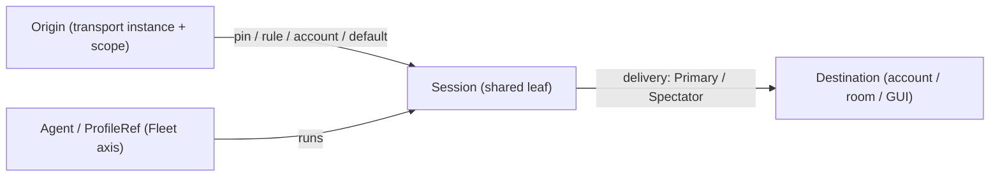

# Routing manager — design (mock-first)

The routing manager is the client surface for **routing the DaemonNet**: wiring inbound
**origins** (a transport account + chat scope, an API caller, a host-internal trigger) to
**sessions** (an engine + agent), and a session's outbound **delivery** to destinations
(accounts, rooms, this GUI). It is the 2-D, first-class view of the same DaemonNet the sidebar
lenses flatten — the "patch-bay" where the wiring is seen and changed.

This document is the source of truth for the surface. Where the older draft
[user-story 05-routing-manager.md](../../user-stories/05-routing-manager.md) or the shipped
`RoutingPage` diverge from the grounded model below, this document is correct.

> Status: mock-first design. The model is realized client-side in `MockDaemonNet`; a daemon
> adapter fills the same projections from the wire later. No contract/CDDL changes.

---

## 0. What it is NOT — the stale `RoutingPage`

The shipped [RoutingPage.qml](../src/DaemonApp/Pages/RoutingPage.qml) (backed by
`automation::MockRoutingStore`) is an **intent -> LLM-model** matrix: rows mapping a free-text
"intent" (e.g. "Code & engineering") to a target **model** id (+ a fallback model) with an enable
toggle. Grounding this against `daemon-node` (this session's study):

- There is **no** inbound "intent" concept in the backend. The only typed `Intent` is
  `daemon-mnemosyne`'s `query_intent::classify_intent`, which biases **memory recall weights** —
  unrelated to routing or model choice.
- A "model" is a fixed string field `ProfileSpec.model` (cloud id / namespaced id / local path),
  with the provider via `ProviderSelector`; it is chosen by **profile**, not by classifying request
  content. The only "fallback" is `fallback_credential_ref` (a *credential-profile* failover for key
  rotation/billing), not a secondary model.
- The closest analogue to "intent -> model" is the orchestrator spec's `WorkClass`/
  `WorkClassBinding { profile, model }` — and it is **spec-only**, with zero Rust implementation.

So `RoutingPage` maps to no implemented feature. Its row grammar (source -> target + toggle) is a
reusable UI pattern, but its content is retired/replaced by this surface.

---

## 1. The routing model (grounded in daemon-node)

Inbound resolution lives in `RoutingRegistry::resolve(origin)`
(`daemon-node/crates/substrate/daemon-host/src/routing.rs:315-347`). It maps an `Origin` to
`Resolved { session, profile, delivery }` by a fixed **precedence**:

1. **Pin** (`ChatPin`, resolve-first) — an explicit `Origin -> { session, profile? }` override of the
   deterministic session naming (`routing.rs:206-212, 318-332`).
2. **Binding rule** (`SessionBinding`) — first ordered match on an `OriginMatcher`
   (transport pattern + scope glob); carries isolation, an optional profile override, and a delivery
   policy (`routing.rs:143-180`). **Config-only** (built from TOML at boot; no runtime CRUD op).
3. **Account-bound profile** (`instance_profiles[transport]`) — the account -> agent baseline,
   derived from each profile's `bound_accounts` (`routing.rs:258-272`).
4. **Node default profile** (`routing.rs:274-278`).

Key types:

- **`Origin` = { transport: TransportId, scope: OriginScope }**, scope ∈ `Dm{user}` /
  `Group{chat,thread}` / `Api{key}` / `Internal` (`origin_pin_key`, `routing.rs:185-201`). The
  transport is an **instance** id (e.g. `matrix/@ops:hs.org`) produced by a `TransportAdapter`.
- **Session** is the shared leaf: the Fleet axis says "agent (ProfileRef) `runs` session"; the
  routing axis says "origin lands in session". A **pin** is the explicit Integrations-axis mirror of
  the Fleet `runs` edge.
- **Delivery**: `DeliveryTarget { transport, route, kind }`, `SinkKind ∈ { Primary, Spectator }`;
  exactly one Primary per session. `handover` re-points Primary (prior demotes to Spectator).

---

## 2. Wire surface (NodeApi) and landed status

All in `daemon-node/crates/contracts/daemon-api/src/lib.rs` unless noted; "landed" = implemented in
`daemon-host`'s `NodeApiImpl`.

### Pins (origin -> session), durable + hot-reloaded + conformance-tested
- `routing_list_chats() -> Vec<ChatRoute>` (`:510`)
- `routing_get(origin) -> Option<ChatRoute>` (`:515`)
- `routing_set(route)` (`:521`), `routing_bind_chat(origin, session, profile?)` (`:527`),
  `routing_unbind_chat(origin)` (`:537`)
- `ChatRoute { origin, session, profile?, isolation(informational) }` (`:2296-2307`)
- Conformance: `routing_pin_resolves_to_bound_session` (`tests/daemon-conformance/src/lib.rs:3169`).
- The **CLI** already calls these (`bins/daemon-cli/src/main.rs:1931,1947`); the GUI/TUI does not.

### Delivery / handover (landed)
- `delivery_targets(session) -> Vec<DeliveryTarget>` (`:229`)
- `delivery_sessions(transport) -> Vec<SessionId>` (`:239`)
- `handover(session, target)` (`:247`)

### Discovery / capability
- `transport_instances() -> Vec<TransportInstanceInfo>` (`:563`) — accounts/instances.
- `transport_rooms(transport) -> Vec<RoomInfo>` (`:543`) — bindable rooms/chats, each marked with its
  pinned session if any (`:2315`).
- `transport_adapters() -> Vec<AdapterInfo>` (`:557`) — capabilities for affordance-gating.
  **Lands inert/skeleton** today.

### Accounts <-> agents
- `profile_list()` (`:1160`), `profile_get`/`profile_update` (`:1165/:1175`) —
  `ProfileSpec.bound_accounts` edited via `profile_update` feeds `instance_profiles`.
- `profile_select()` (`:1185`) — node active default.

### Sessions / peek / connect
- `sessions()` / `sessions_query()` (`:341`) — pin targets / delivery subjects.
- `subscribe(session, after_seq)` (`:221`) — read-only peek (the only spectator-attach path).
- `auth_providers`/`auth_begin`/`auth_complete`/`auth_cancel` (`:1427-1447`) — bring an account online.

### Data plane (context, not UI controls)
- `submit_routed(origin, command)` (`:171`) — the inbound entry that calls `resolve()`.
- `deliver(target, entry)` (`EventSink`, `:118`) — outbound; what `handover` re-points.

---

## 3. What belongs in DaemonNet (and what does not)

DaemonNet (`IDaemonNet` / `MockDaemonNet`) is the single client-side source every surface projects
from. Today it models the **resulting** binding (`over` session->transport, `inPlace`
session->place, `participant` session->peer; `runs`/`delegation` for the Fleet) but **not** routing
provenance or delivery direction.

**Represent in DaemonNet** (so the topology half is a faithful projection):
- `Origin` as first-class (transport instance + scope). The client DTO `domain/origin.h` exists but
  is unused by the graph.
- **Directional routing edges**: inbound `origin -> session` with **provenance**
  (`pinned` | `account-bound` | `derived`), and outbound `session -> destination` with **`SinkKind`**
  (`primary` | `spectator`). The client DTO `domain/delivery.h` exists but is unused by the graph.
- **Destination nodes** (account / room / this-GUI), distinct from the inbound transport.
- **account -> profile** edges (the bound-account baseline).

**Keep OUT of the graph** (control-half state / resolution parameters, not edges):
- Binding rules (`SessionBinding` matchers), isolation policy, instance-profiles, node default, auth.
  These parameterize `resolve()`; they live in the control panels, not as nodes/edges.
- `decidedBy` is a **derived** attribute (computed by walking the precedence), not stored state.

---

## 4. The surface — hybrid (topology + control)

Two halves; the control half carries the feature, the topology half is orientation (its value grows
with rooms).

### Topology half (orientation)
The DaemonNet rendered as a 2-D patch-bay: origin -> session -> destination, rooms as N-party
interconnects, delegation edges for context. Edge styling encodes **direction**, **provenance**
(pinned solid / derived faint), and **`SinkKind`** (Primary solid / Spectator dashed). Read-mostly:
pan/zoom, click-to-inspect, select-sync with the control panels. The one drawable gesture is
dragging `origin -> session` to create a **pin**; everything else is rule-derived and not drawable.

### Control half (the editing)

| Panel | Backed by (wire op) | DaemonNet | Notes |
| --- | --- | --- | --- |
| Pins editor (`origin -> session (+agent)`) | `routing_bind_chat`/`set`/`unbind`/`list`/`get`; `transport_rooms` to discover | inbound pinned edge | landed |
| Delivery / handover (per session) | `delivery_targets`/`delivery_sessions`/`handover` | outbound edges + SinkKind | landed; "Take" action |
| Accounts <-> agents | `profile_update(bound_accounts)`, `profile_list` | account->profile edge | landed (backend hot-reload incomplete, ROU-4) |
| Rules + isolation | none at runtime | not an edge (param) | **read-only**, tagged "config-time" |
| Resolution explainer | none (reconstructed) | derived attribute | mock-complete (see §5) |
| Live discovery / peek | `delivery_sessions`, `subscribe` | read overlay | landed; peek-only |
| Capability gating | `transport_adapters` | node metadata | adapter enum inert today |
| Connect / add account | `auth_*` | new instance node | landed |

---

## 5. Decisions

- **Form**: hybrid — topology overview + structured control panels, select-synced. Not a free-form
  node canvas (routing is *resolved*, not *drawn*) and not a single crosspoint matrix (the 3-stage
  pipeline + precedence don't reduce to one grid).
- **Resolution explainer = mock-complete**: `MockDaemonNet` models the full precedence (pins +
  binding rules + instance-profiles + default), so `resolve(origin) -> { session, profile, delivery,
  decidedBy }` is whole now. Rungs with no live wire op (config rules, isolation) are surfaced
  **read-only** and tagged "config-time"; they won't introspect against a live host until a wire op
  exists.
- **Retire** the `RoutingPage` intent->model content (and `MockRoutingStore`); reuse only its row
  grammar.

---

## 6. Gaps (honest)

- **Client/mock (in scope)**: DaemonNet has no `Origin` node, no directional routing edges, no
  `SinkKind`, no pin provenance, no destination nodes, no account->profile edge. `MockDaemonNet`
  seeds all of this.
- **Wire (out of scope, designed around)**: no single resolution-explain op and binding-rules/
  instance-profiles aren't readable over the wire (explainer is mock-complete but wire-partial); no
  runtime isolation/binding CRUD (config-only); account->agent hot-reload incomplete
  (`routing_builder` not installed); `transport_adapters` inert; `RoomApi` (room membership/floor)
  absent; no explicit spectator-attach (peek = `subscribe`).

---

## 7. References
- `daemon-node/crates/substrate/daemon-host/src/routing.rs` — `RoutingRegistry`, `ChatPin`, `resolve`.
- `daemon-node/crates/contracts/daemon-api/src/lib.rs` — `routing_*` / `delivery_*` / `handover` /
  `transport_*` / `profile_*` ops; `ChatRoute`, `DeliveryTarget`, `SinkKind`.
- `daemon-node/crates/contracts/daemon-protocol` — `Origin`, `OriginScope`, `IsolationPolicy`.
- [multi-protocol-client-surface.md](./multi-protocol-client-surface.md) §1 — the DaemonNet model.
- Client DTOs already present: `src/core/domain/origin.h`, `src/core/domain/delivery.h`.
